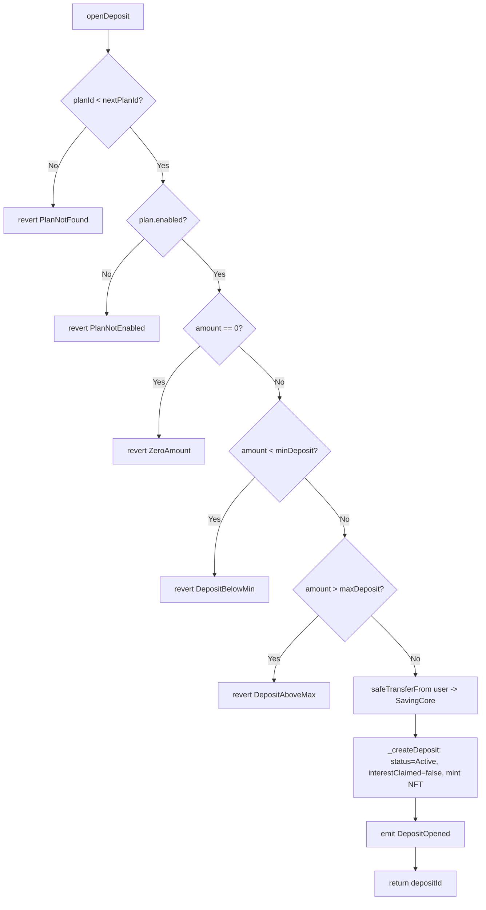
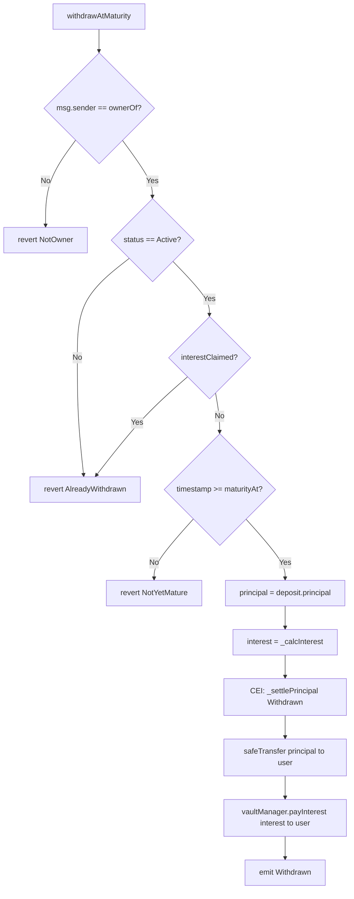
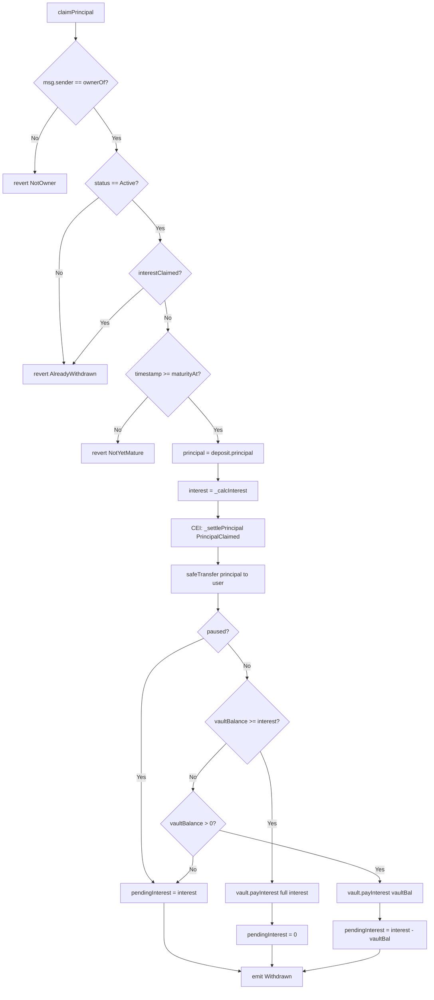
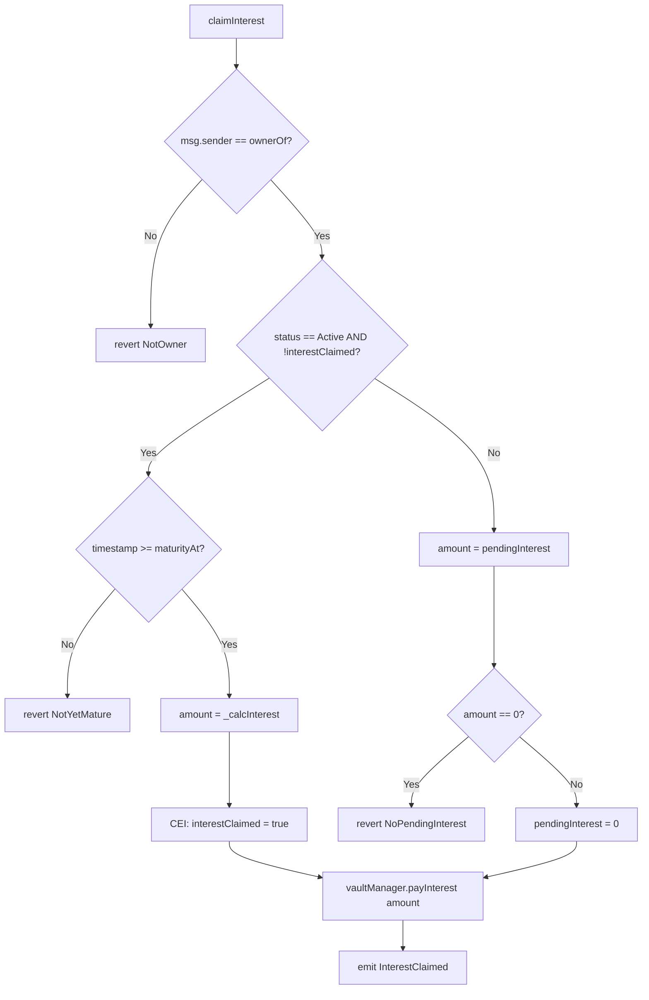
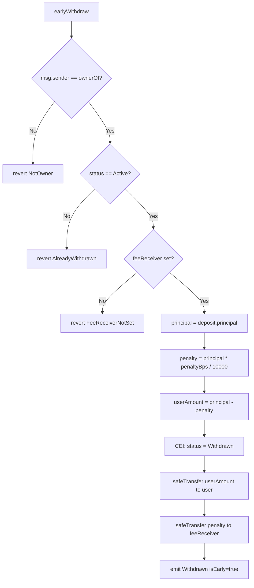
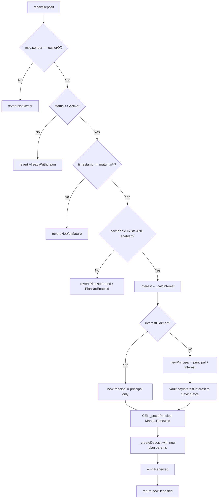
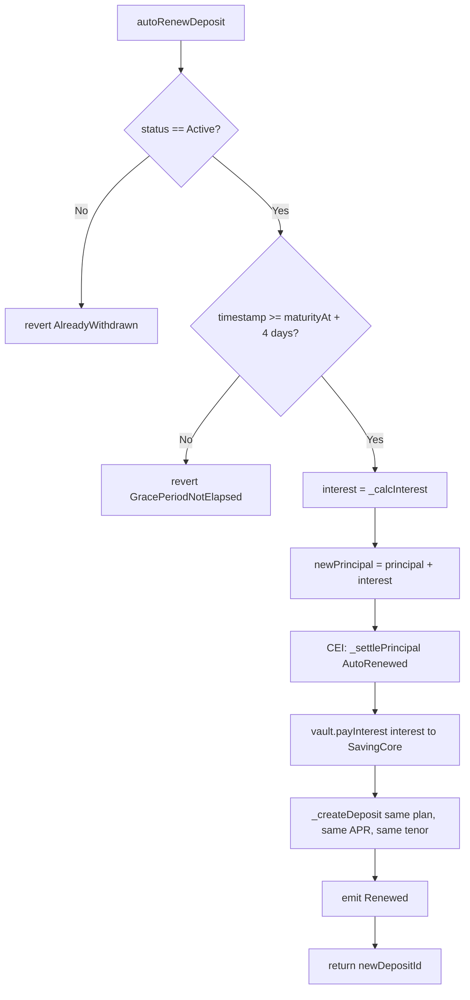
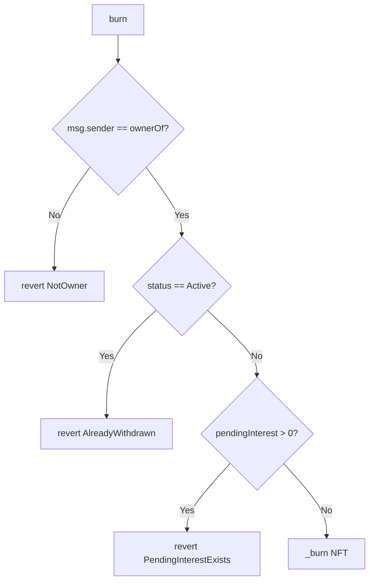

# Deposit State Machine — Status Enum & Interest Flag

> Auto-generated from `contracts/core/SavingCore.sol` (post-refactor) and verified against
> 123 passing unit tests in `test/unit/SavingCore/`.

---

## 1. Status Enum Reference

| Value | Name             | Semantics                                                       | Set by                                      |
|-------|------------------|-----------------------------------------------------------------|---------------------------------------------|
| 0     | `Active`         | Principal locked in SavingCore. Deposit is live.                | `_createDeposit` (initial)                  |
| 1     | `Withdrawn`      | Principal + interest fully settled. Terminal state.             | `withdrawAtMaturity`, `earlyWithdraw`       |
| 2     | `PrincipalClaimed` | Principal paid out; interest may still be pending.           | `claimPrincipal`                            |
| 3     | `ManualRenewed`  | User renewed into a new plan. Terminal state.                   | `renewDeposit`                              |
| 4     | `AutoRenewed`    | Auto-renewed after grace period. Terminal state.                | `autoRenewDeposit`                          |

### Separated Concern: `interestClaimed` (bool)

| Value | Meaning                                                       | Set by                                 |
|-------|---------------------------------------------------------------|----------------------------------------|
| false | Interest has NOT been claimed on this deposit.                | `_createDeposit` (initial)             |
| true  | Interest HAS been claimed. Status stays `Active`.             | `claimInterest` (Path A)               |

**Key invariant:** `interestClaimed = true` + `status = Active` means principal is still
locked in SavingCore but interest has been paid out. This combination blocks `withdrawAtMaturity`,
`claimPrincipal`, and causes `renewDeposit` to renew with principal-only (no compound).

---

## 2. State Diagram

```
                            ┌──────────────────────────────┐
                            │          Active              │
                            │   (interestClaimed=false)    │
                            └──┬──────┬──────┬──────┬──────┘
                               │      │      │      │
        withdrawAtMaturity     │      │   renewDeposit  autoRenewDeposit
        (vault pays int)       │      │   (compound)    (compound, anyone)
                               │      │      │      │
                               ▼      │      │      │
                          Withdrawn   │      │      │
                               ✗      │      │      │
                            burn OK   │      │      │
                                      │      │      │
                    claimPrincipal    │      │      │
                    (C1: safe exit)   │      │      │
                                      ▼      ▼      ▼
                               Principal  Manual   Auto
                                Claimed  Renewed  Renewed
                                  ✗        ✗        ✗
                               burn OK   burn OK  burn OK

  ──────────────────────────────────────────────────────────────────
  INTEREST FLAG (parallel axis, does NOT change Status) :

  claimInterest Path A (Active, not yet claimed):
    Active ──→ Active  [interestClaimed: false → true]

  claimInterest Path B (after PrincipalClaimed, pending > 0):
    PrincipalClaimed ──→ PrincipalClaimed  [pendingInterest cleared to 0]
```

### Transition Table

| From State | Guard(s)                              | Function              | To State        | interestClaimed |
|------------|---------------------------------------|-----------------------|-----------------|-----------------|
| Active     | `>= maturityAt`                       | `withdrawAtMaturity`  | Withdrawn       | —               |
| Active     | `>= maturityAt`                       | `claimPrincipal`      | PrincipalClaimed| —               |
| Active     | `>= maturityAt`, `!interestClaimed`   | `claimInterest` (A)   | Active          | true            |
| Active     | `feeReceiver set`                     | `earlyWithdraw`       | Withdrawn       | —               |
| Active     | `>= maturityAt`                       | `renewDeposit`        | ManualRenewed   | —               |
| Active     | `>= maturityAt + 4 days`              | `autoRenewDeposit`    | AutoRenewed     | —               |
| Active     | `interestClaimed=true`                | `renewDeposit`        | ManualRenewed   | — (principal only) |
| Active     | `interestClaimed=true`                | `withdrawAtMaturity`  | **REVERT**      | —               |
| Active     | `interestClaimed=true`                | `claimPrincipal`      | **REVERT**      | —               |

---

## 3. Function Activity Diagrams

### 3.1 `openDeposit(planId, amount)`



**Test coverage:** `SavingCore.openDeposit.test.ts` — 11 tests

---

### 3.2 `withdrawAtMaturity(depositId)`



**Test coverage:** `SavingCore.withdrawAtMaturity.test.ts` — 12 tests

---

### 3.3 `claimPrincipal(depositId)`



**Test coverage:** `SavingCore.c1.test.ts` — 15 tests (C1: principal is always safe)

---

### 3.4 `claimInterest(depositId)`



**Test coverage:** `SavingCore.interestClaim.test.ts` — 10 tests

---

### 3.5 `earlyWithdraw(depositId)`



**Note:** No interest is paid. No vault interaction. No maturity check.
**Test coverage:** `SavingCore.earlyWithdraw.test.ts` — 9 tests

---

### 3.6 `renewDeposit(depositId, newPlanId)`



**Test coverage:** `SavingCore.renewDeposit.test.ts` — 10 tests

---

### 3.7 `autoRenewDeposit(depositId)`



**Key difference from `renewDeposit`:**
- No owner check (anyone/bot can call)
- No `interestClaimed` check (auto-renew always compounds)
- Same plan, same APR (locked to snapshot), different caller model

**Test coverage:** `SavingCore.autoRenew.test.ts` — 9 tests

---

### 3.8 `burn(depositId)`



**Note:** `pendingInterest` check is in `_update` override, not in `burn` directly.
**Test coverage:** `SavingCore.c1.test.ts` — 2 tests (#13, #14)

---

## 4. Key Business Invariants Preserved

1. **C1 — Principal is always safe:** `claimPrincipal` has no `whenNotPaused` modifier. User can always recover principal regardless of system state.

2. **Interest never double-paid:** `interestClaimed=true` blocks `withdrawAtMaturity` and `claimPrincipal`. The `claimInterest` Path A sets the flag before any external call.

3. **APR immutability:** All interest calculations use `aprBpsAtOpen` (snapshotted at deposit time), never the current plan APR.

4. **Boundary at `maturityAt`:** `>=` consistently — at the exact maturity second, all maturity-gated functions are allowed.

5. **CEI compliance:** `_settlePrincipal()` and `_calcInterest()` are free of external calls. State is always updated before `safeTransfer`/`payInterest`.

6. **Vault separation:** Principal always from SavingCore balance. Interest always from VaultManager. `earlyWithdraw` penalty goes to `feeReceiver`, not vault.
