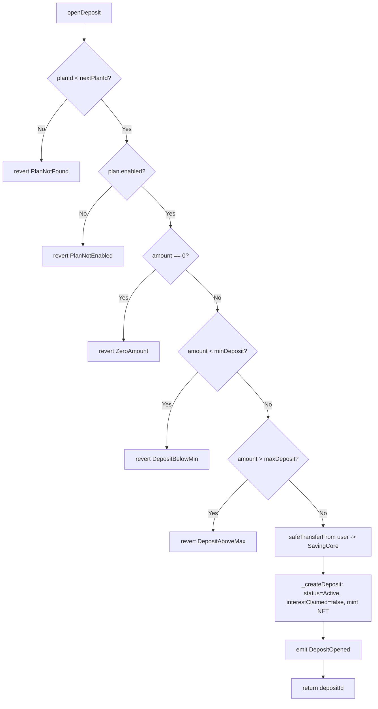
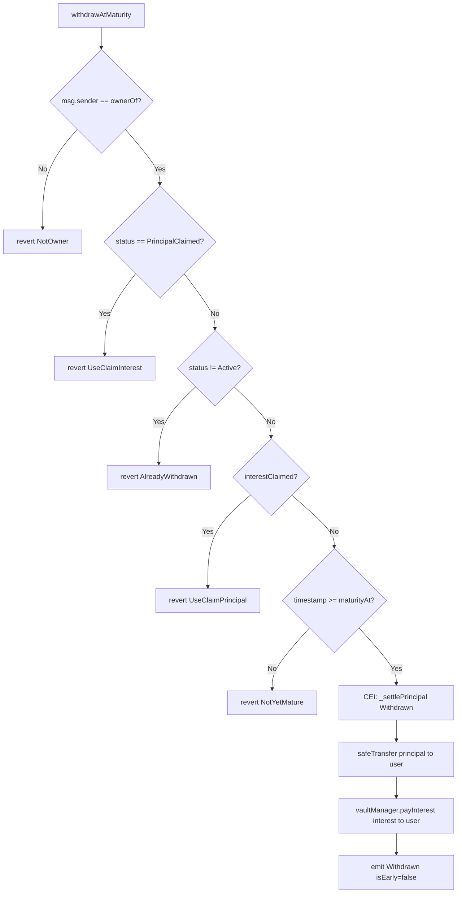
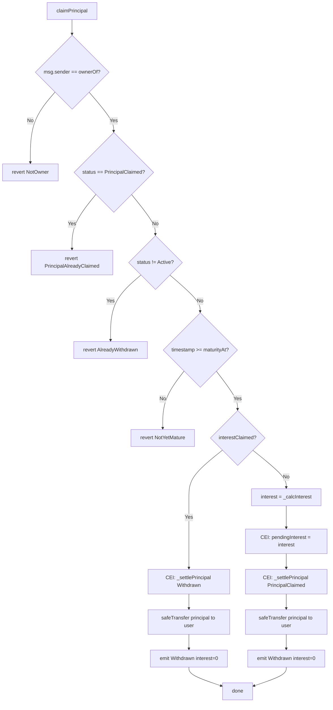
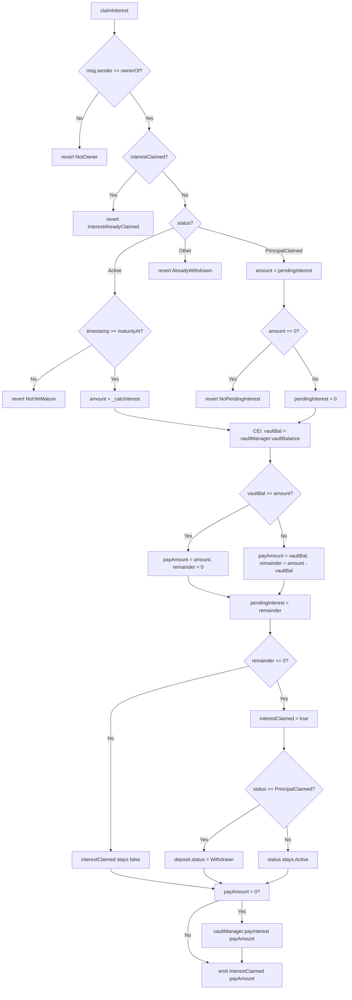
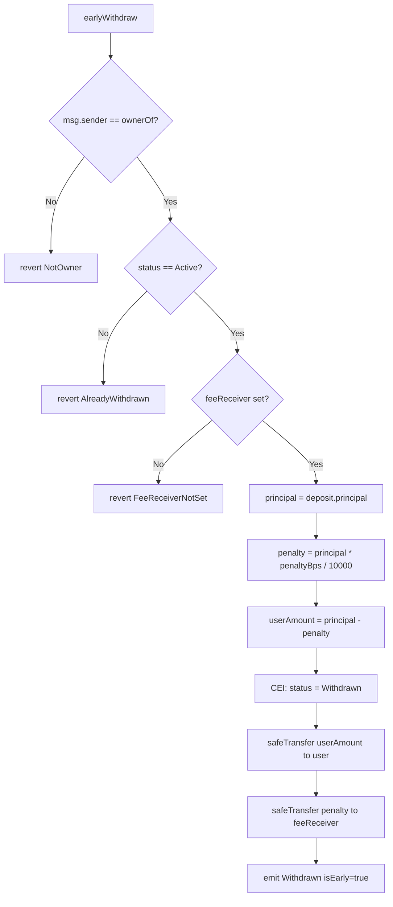
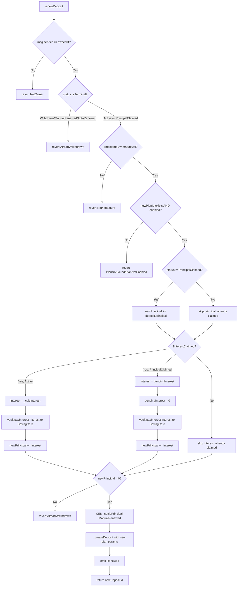
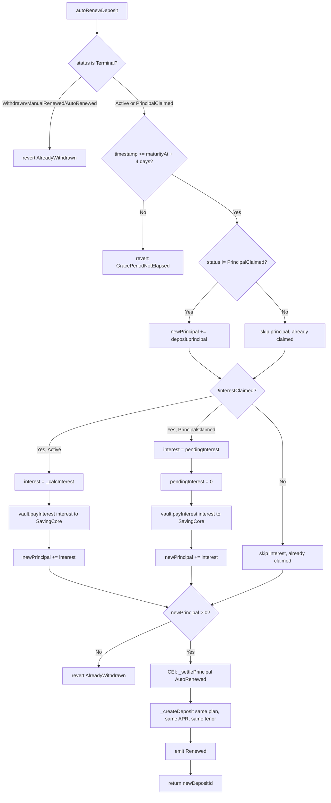
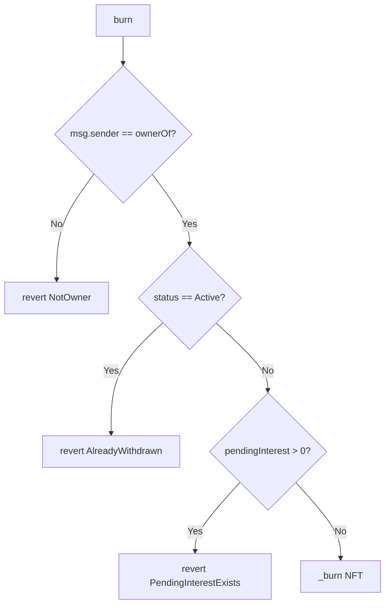

# Deposit State Machine — Status Enum & Interest Flag

> Auto-generated from `contracts/core/SavingCore.sol` (post-refactor) and verified against
> 142 passing unit tests in `test/unit/SavingCore/`.

---

## 1. Status Enum Reference

| Value | Name               | Semantics                                                        | Set by                                         |
|-------|--------------------|------------------------------------------------------------------|------------------------------------------------|
| 0     | `Active`           | Principal locked in SavingCore. Deposit is live.                 | `_createDeposit` (initial)                     |
| 1     | `Withdrawn`        | Principal + interest fully settled. Terminal state.              | `withdrawAtMaturity`, `earlyWithdraw`, `claimPrincipal` (when interestClaimed), `claimInterest` (when PrincipalClaimed + full payment) |
| 2     | `PrincipalClaimed` | Principal paid out; interest is pending as `pendingInterest`.    | `claimPrincipal`                               |
| 3     | `ManualRenewed`    | User renewed into a new plan. Terminal state.                    | `renewDeposit`                                 |
| 4     | `AutoRenewed`      | Auto-renewed after grace period. Terminal state.                 | `autoRenewDeposit`                             |

### Separated Concern: `interestClaimed` (bool)

| Value | Meaning                                                       | Set by                                                        |
|-------|---------------------------------------------------------------|---------------------------------------------------------------|
| false | Interest has NOT been claimed on this deposit.                | `_createDeposit` (initial)                                    |
| true  | Interest HAS been fully claimed.                              | `claimInterest` (full payment — both Path A and Path B)       |

**Key invariant:** `interestClaimed = true` + `status = Active` means principal is still
locked in SavingCore but interest has been paid out. `withdrawAtMaturity` and `claimPrincipal`
revert with `UseClaimPrincipal` / `UseClaimInterest` to guide users to the correct function.

### Interest Payment Model

Interest can be paid in **two independent steps**:
1. **claimPrincipal** — pays principal from SavingCore balance (no vault). Interest is calculated and stored as `pendingInterest[depositId]`. No `whenNotPaused` (C1 guarantee).
2. **claimInterest** — pays interest from VaultManager. Supports **partial vault payment**: if vault balance < amount, pays what's available, stores remainder as `pendingInterest`, `interestClaimed` stays `false` (allows retry).

The `withdrawAtMaturity` function is a convenience shortcut that pays both principal + interest in one call, but **only when neither has been claimed yet**.

---

## 2. State Diagram

```
                          ┌──────────────────────────────┐
                          │          Active              │
                          │   (interestClaimed=false)    │
                          └──┬─────┬─────┬─────┬─────┬───┘
                             │     │     │     │     │
  withdrawAtMaturity         │     │  renewDeposit  autoRenewDeposit
  (principal+interest)       │     │  (compound)    (compound, anyone)
                             │     │     │     │     │
                             ▼     │     │     │     │
                        Withdrawn  │     │     │     │
                             ✗     │     │     │     │
                          burn OK  │     │     │     │
                                   │     │     │     │
                    claimPrincipal │     │     │     │
                    (C1: principal │     │     │     │
                     only, always  ▼     ▼     ▼     ▼
                     available)  Principal  Manual  Auto
                                  Claimed  Renewed Renewed
                                   ✗         ✗       ✗
                                burn OK*  burn OK  burn OK

  ──────────────────────────────────────────────────────────────────
  INTEREST FLAG (parallel axis, does NOT change Status) :

  claimInterest Path A (Active, mature, not yet claimed):
    Active ──→ Active  [interestClaimed: false → true]

  claimInterest Path B (PrincipalClaimed, pending > 0):
    PrincipalClaimed ──→ Withdrawn  [interestClaimed: true, pending cleared]

  claimInterest partial (any state, vault < amount):
    No status change  [pendingInterest += remainder, interestClaimed stays false]

  * burn blocked when pendingInterest > 0
```

### Transition Table

| From State       | Guard(s)                                       | Function              | To State        | Notes                    |
|------------------|------------------------------------------------|-----------------------|-----------------|--------------------------|
| Active           | `>= maturityAt`                                | `withdrawAtMaturity`  | Withdrawn       | principal + interest     |
| Active           | `>= maturityAt`                                | `claimPrincipal`      | PrincipalClaimed| interest → pending       |
| Active           | `>= maturityAt`                                | `claimInterest` (A)   | Active          | interestClaimed=true     |
| Active           | `feeReceiver set`                              | `earlyWithdraw`       | Withdrawn       | penalty only, no vault   |
| Active           | `>= maturityAt`                                | `renewDeposit`        | ManualRenewed   | compound principal+int   |
| Active           | `>= maturityAt + 4 days`                       | `autoRenewDeposit`    | AutoRenewed     | compound, anyone can call|
| Active           | `interestClaimed=true` + `>= maturityAt`       | `withdrawAtMaturity`  | → reverts UseClaimPrincipal | |
| Active           | `interestClaimed=true` + `>= maturityAt`       | `claimPrincipal`      | Withdrawn       | principal only, no vault |
| PrincipalClaimed | `>= maturityAt`                                | `claimInterest` (B)   | Withdrawn       | pays pending, full → Withdrawn |
| PrincipalClaimed | `>= maturityAt`                                | `renewDeposit`        | ManualRenewed   | renew with interest only |
| PrincipalClaimed | `>= maturityAt + 4 days`                       | `autoRenewDeposit`    | AutoRenewed     | renew with interest only |
| PrincipalClaimed | `interestClaimed=true`                         | `claimInterest`       | → reverts InterestAlreadyClaimed | |
| Withdrawn        | any                                            | any state change      | → reverts AlreadyWithdrawn | terminal |
| ManualRenewed    | any                                            | any state change      | → reverts AlreadyWithdrawn | terminal |
| AutoRenewed      | any                                            | any state change      | → reverts AlreadyWithdrawn | terminal |

---

## 3. Function Activity Diagrams

### 3.1 `openDeposit(planId, amount)`



**Test coverage:** `SavingCore.openDeposit.test.ts` — 11 tests

---

### 3.2 `withdrawAtMaturity(depositId)`



**Test coverage:** `SavingCore.withdrawAtMaturity.test.ts` — 14 tests

---

### 3.3 `claimPrincipal(depositId)`



**Key design:** `claimPrincipal` never touches the vault. Interest is always stored as `pendingInterest`. No `whenNotPaused` modifier — C1 guarantee.

**Test coverage:** `SavingCore.c1.test.ts` — 18 tests

---

### 3.4 `claimInterest(depositId)`



**Key design:** Supports partial vault payment. If vault < full interest, pays what's available, stores remainder as `pendingInterest`. User can retry after vault is refunded. `interestClaimed` only set to `true` on full payment.

**Test coverage:** `SavingCore.interestClaim.test.ts` — 15 tests

---

### 3.5 `earlyWithdraw(depositId)`



**Note:** No interest is paid. No vault interaction. No maturity check.

**Test coverage:** `SavingCore.earlyWithdraw.test.ts` — 9 tests

---

### 3.6 `renewDeposit(depositId, newPlanId)`



**Key design:** Allows renewal from `Active` or `PrincipalClaimed` status. Compounds whatever remains (principal and/or interest). Terminal states (`Withdrawn`, `ManualRenewed`, `AutoRenewed`) revert.

**Test coverage:** `SavingCore.renewDeposit.test.ts` — 14 tests

---

### 3.7 `autoRenewDeposit(depositId)`



**Key differences from `renewDeposit`:**
- No owner check — anyone/bot can call
- Same plan, same APR (locked to snapshot), different caller model
- Grace period required (`maturityAt + 4 days`)

**Test coverage:** `SavingCore.autoRenew.test.ts` — 14 tests

---

### 3.8 `burn(depositId)`



**Note:** `pendingInterest` check is in `_update` override, not in `burn` directly.

**Test coverage:** `SavingCore.c1.test.ts` — 2 tests (#13, #14)

---

## 4. Key Business Invariants Preserved

1. **C1 — Principal is always safe:** `claimPrincipal` has no `whenNotPaused` modifier. User can always recover principal regardless of system state. Interest is stored as `pendingInterest` for later claim.

2. **Interest never double-paid:** `interestClaimed=true` is only set on full payment. `claimInterest` checks `interestClaimed` before any calculation. Partial payments leave `interestClaimed=false` for retry.

3. **Specific revert guidance:** When a function is blocked by partial claim state, reverts with `UseClaimInterest` or `UseClaimPrincipal` to guide the user to the correct function.

4. **APR immutability:** All interest calculations use `aprBpsAtOpen` (snapshotted at deposit time), never the current plan APR.

5. **Boundary at `maturityAt`:** `>=` consistently — at the exact maturity second, all maturity-gated functions are allowed.

6. **CEI compliance:** `_settlePrincipal()` and `_calcInterest()` are free of external calls. State is always updated before `safeTransfer`/`payInterest`.

7. **Vault separation:** Principal always from SavingCore balance. Interest always from VaultManager. `earlyWithdraw` penalty goes to `feeReceiver`, not vault.

8. **Partial vault payment:** `claimInterest` gracefully handles insufficient vault balance — pays what's available, stores remainder as `pendingInterest` for retry after vault is refunded.

9. **Renewal flexibility:** `renewDeposit` and `autoRenewDeposit` allow renewal from `PrincipalClaimed` status — compounds whatever remains (interest only if principal was already claimed).
