# Activity Diagrams

This document describes the activity diagrams for the **Blockchain-Based Online Saving System**. Each diagram covers one major user flow or admin operation, using Mermaid `flowchart TD` with swimlanes.

---

## System Parameters (Personal Variant — ID ending in 38)

| Parameter | Value |
|-----------|-------|
| Grace Period | 4 days |
| Default APR | 400 bps (4.00%) |
| Early Withdrawal Penalty | 450 bps (4.50%) |
| Default Tenor | 180 days |

---

## 1. Open Deposit Flow

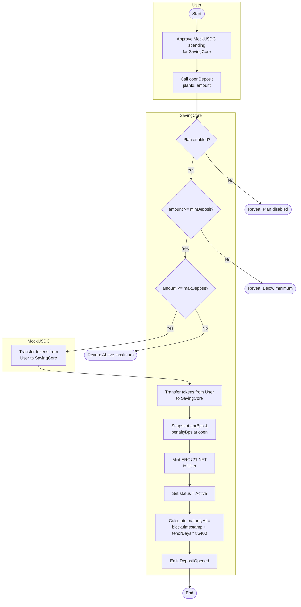

---

## 2. Withdraw at Maturity Flow

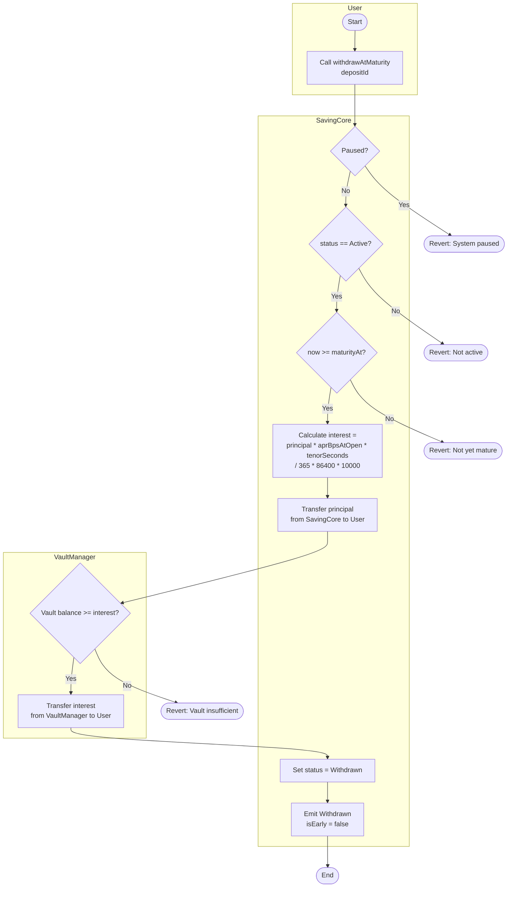

---

## 3. Early Withdraw Flow

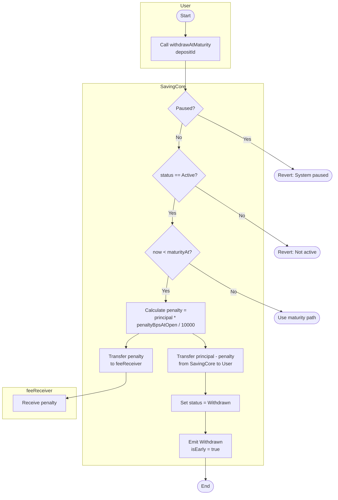

---

## 4. Manual Renew Flow

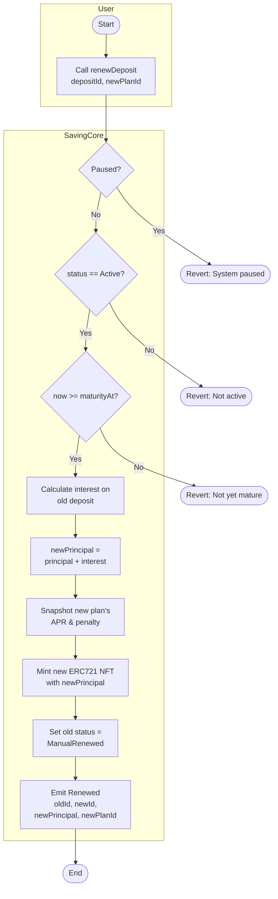

---

## 5. Auto-Renew Flow

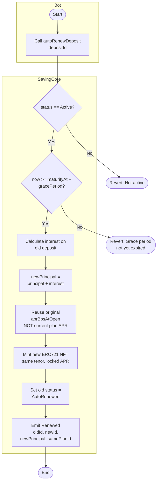

---

## 6. Admin — Plan Management

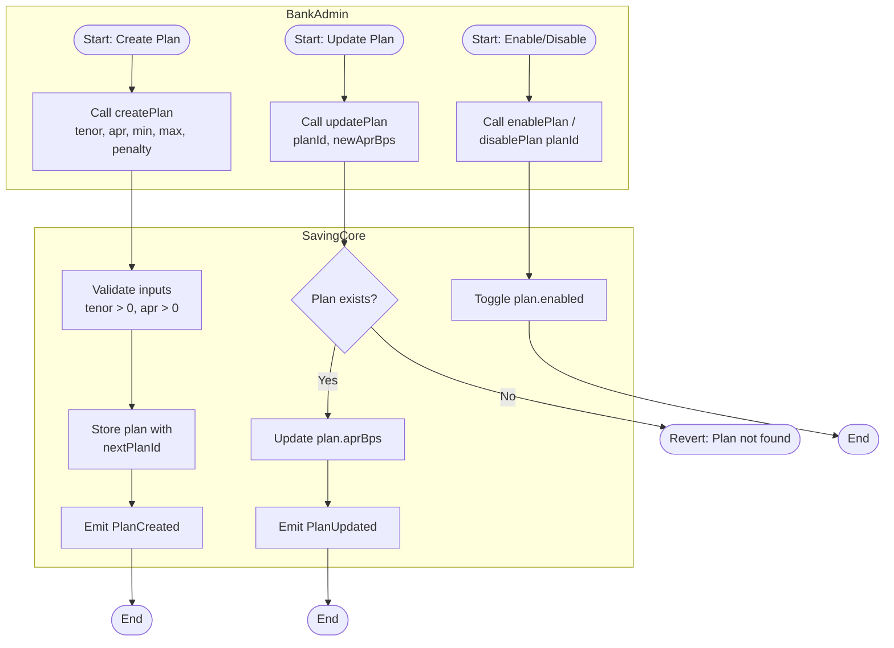

---

## 7. Admin — Vault & System Management

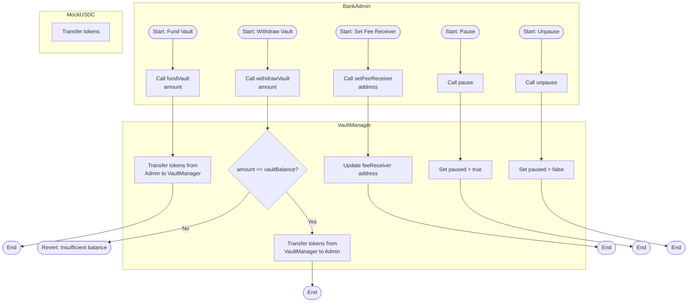

---

## Bonus Challenges

### C1: Principal Protection (Vault Empty)

Extends Diagram 2 (Withdraw at Maturity). When the vault cannot pay full interest:

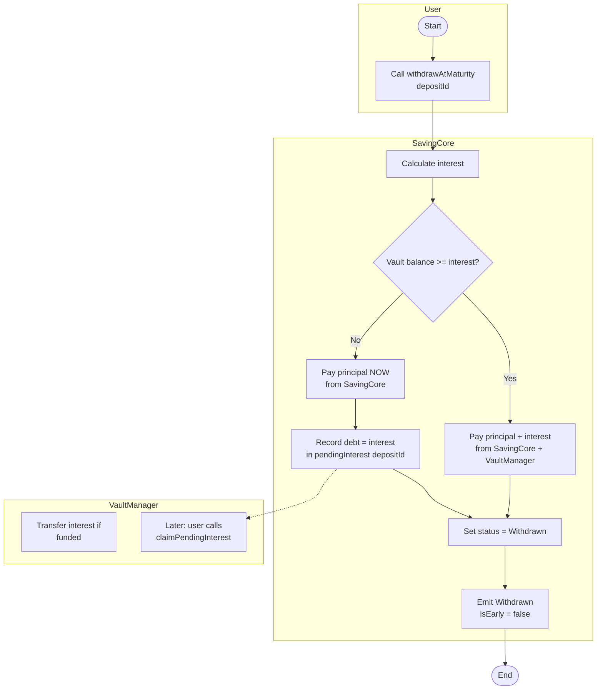

---

### C2: Solvency Guard (Vault Withdraw Check)

Extends Diagram 7 (Admin — Withdraw Vault):

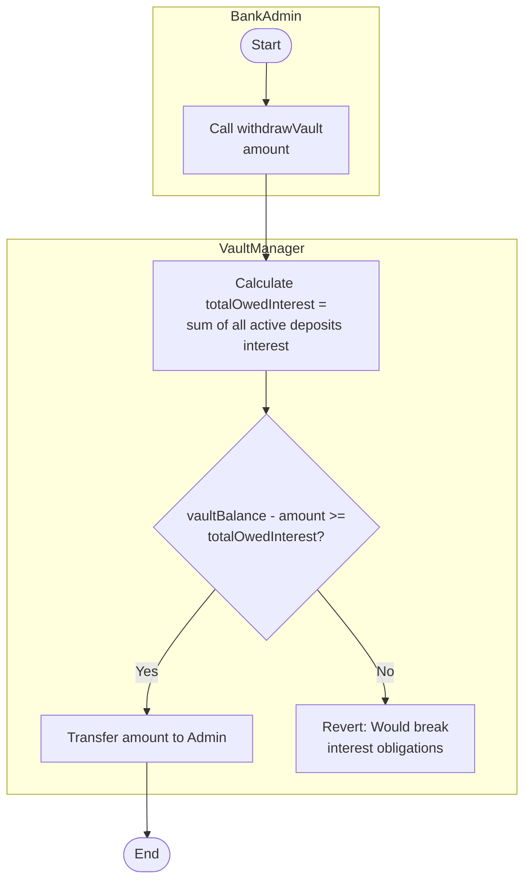

---

### C3: Partial Early Withdraw

Extends Diagram 3 (Early Withdraw):

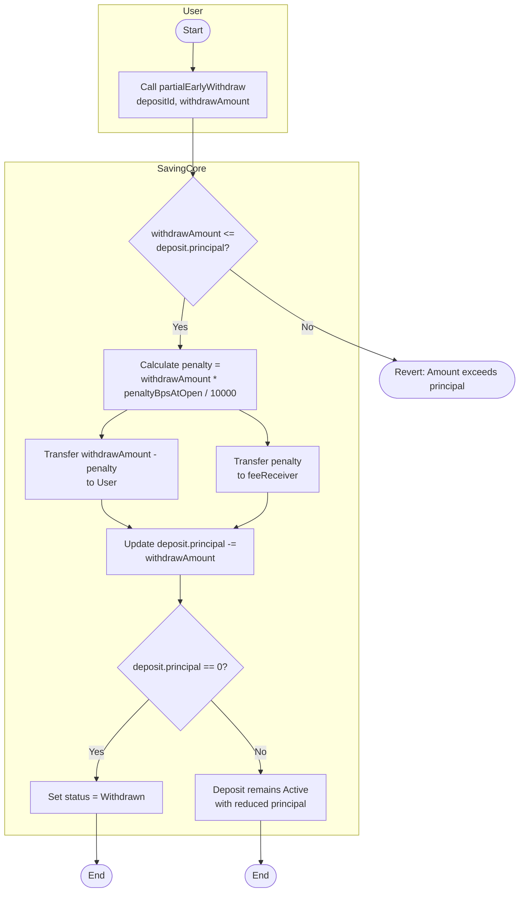

---

### C4: Top-up Deposit

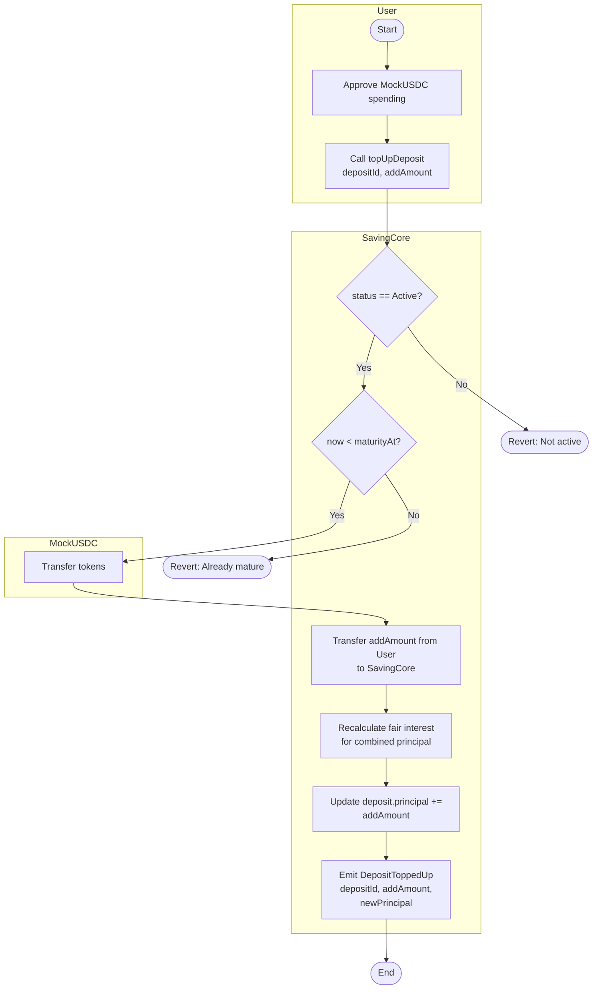

---

## Flow Summary Table

| # | Flow | Actor | Key Decision Points |
|---|------|-------|---------------------|
| 1 | Open Deposit | User | Plan enabled, min/max bounds |
| 2 | Withdraw at Maturity | User | Paused, active, mature, vault funded |
| 3 | Early Withdraw | User | Paused, active, before maturity |
| 4 | Manual Renew | User | Paused, active, at/past maturity |
| 5 | Auto-Renew | Bot | Active, grace period expired |
| 6 | Plan Management | Admin | Plan exists, valid inputs |
| 7 | Vault & System | Admin | Balance check, pause state |
| C1 | Principal Protection | User | Vault insufficient -> pay principal only |
| C2 | Solvency Guard | Admin | Withdraw would break obligations |
| C3 | Partial Early Withdraw | User | Amount within principal, partial penalty |
| C4 | Top-up Deposit | User | Active, not yet mature |
