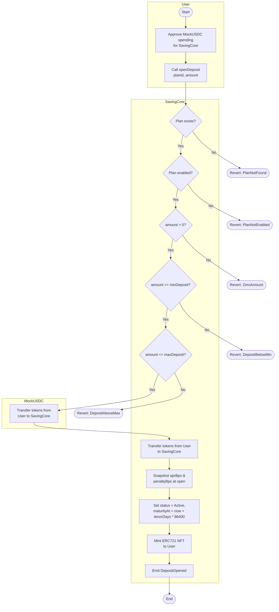
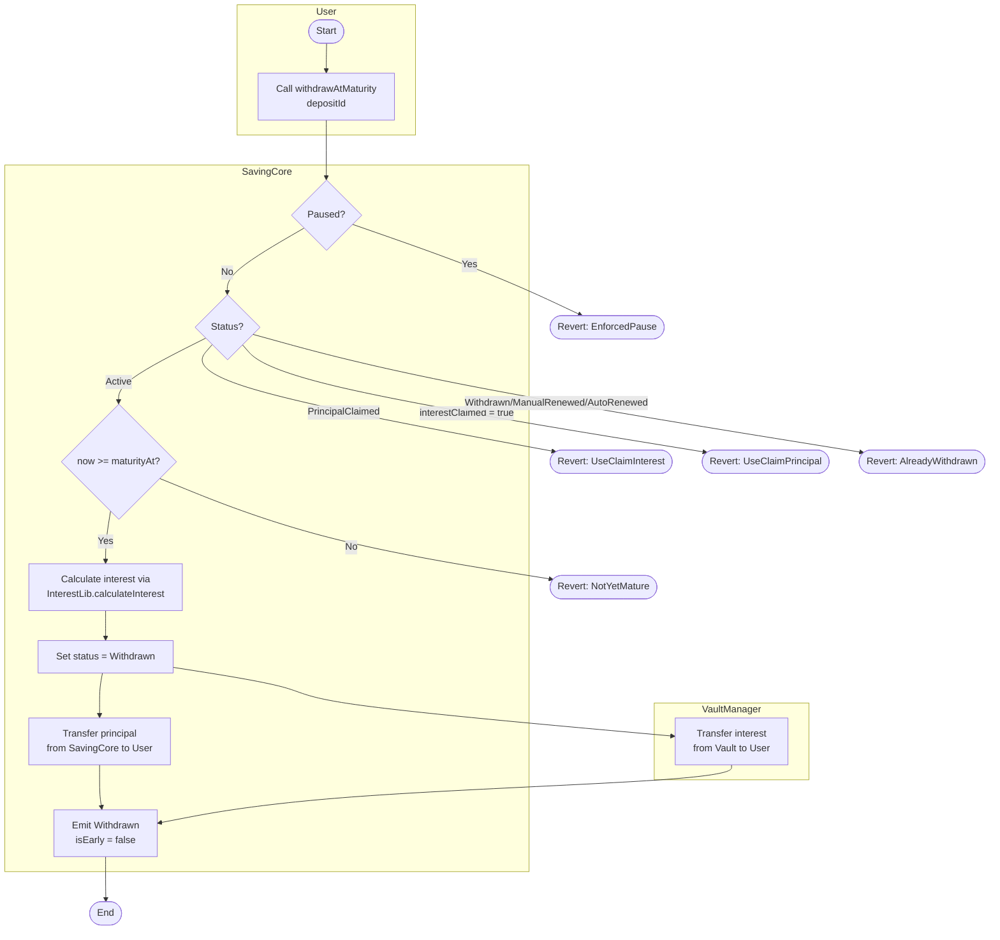
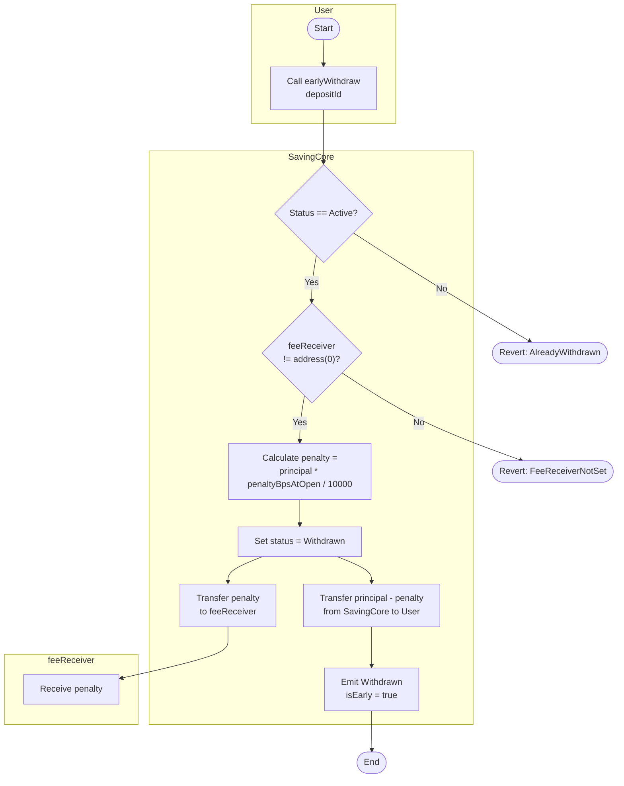
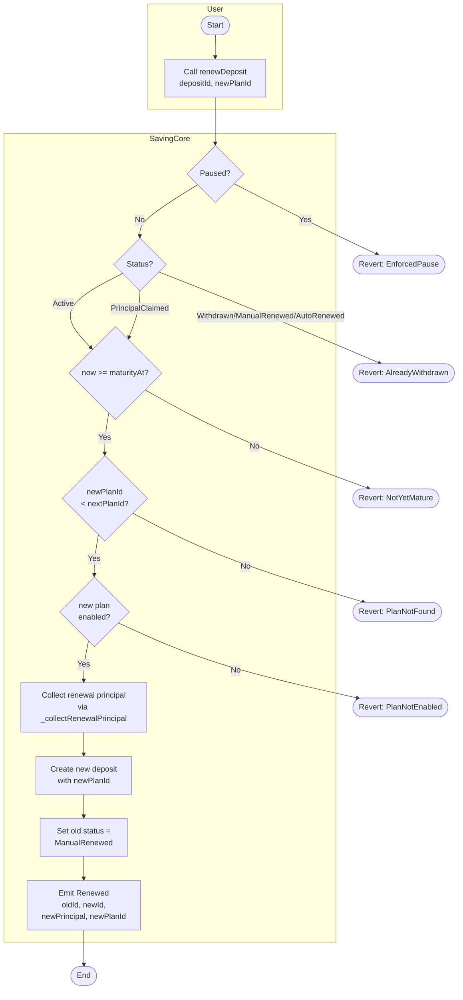
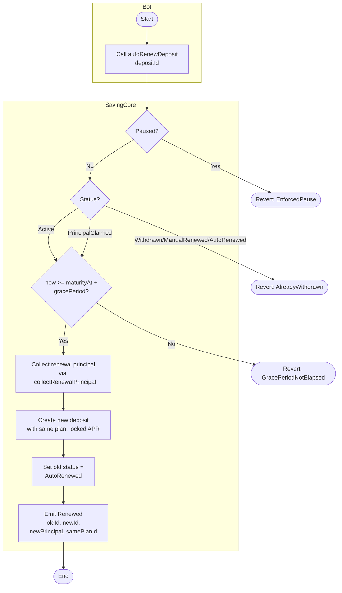
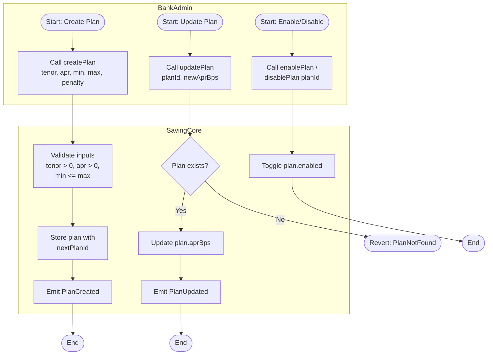
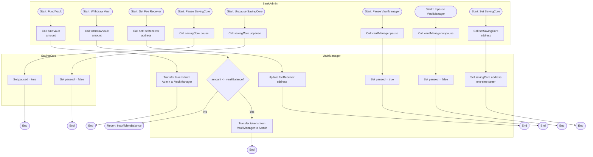
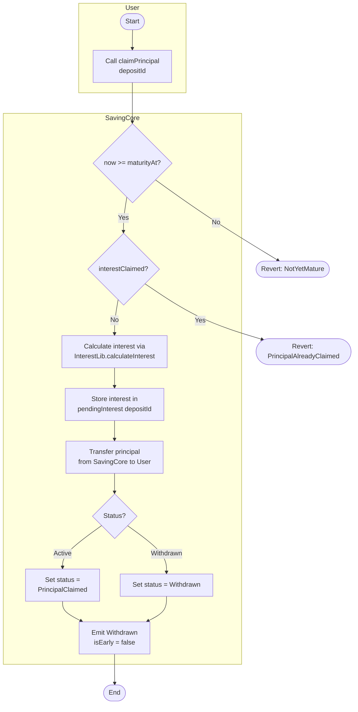
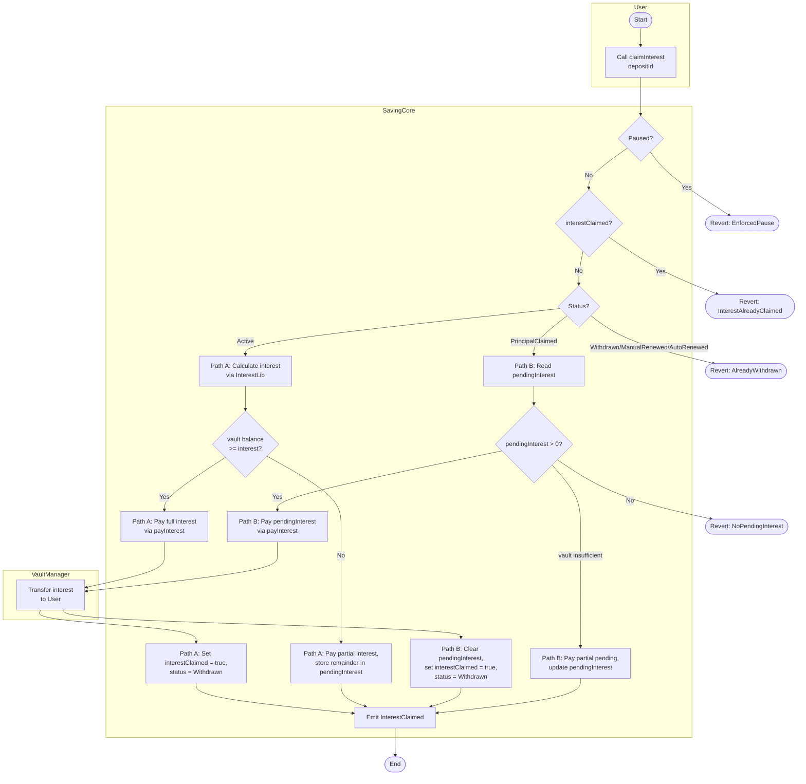
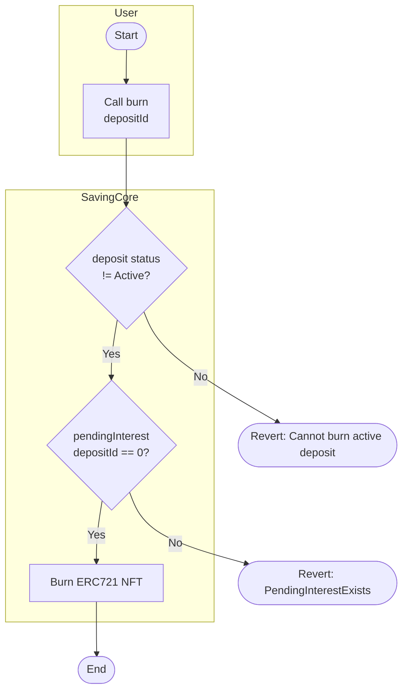

# Activity Diagrams

This document describes the activity diagrams for the **Blockchain-Based Online Saving System**. Each diagram covers one major user flow or admin operation, using Mermaid `flowchart TD` with swimlanes.

---

## System Parameters (Personal Variant — ID ending in 38)

| Parameter | Value | Source |
|-----------|-------|--------|
| Grace Period | 4 days | §8.1 |
| Default APR | 400 bps (4.00%) | §8.1 |
| Early Withdrawal Penalty | 450 bps (4.50%) | §8.1 |
| Default Tenor | 180 days | §8.1 |

---

## Modifier Reference

| Function | `nonReentrant` | `whenNotPaused` | `onlyDepositOwner` | `onlyOwner` |
|----------|:-:|:-:|:-:|:-:|
| `openDeposit` | ✅ | — | — | — |
| `withdrawAtMaturity` | ✅ | ✅ | ✅ | — |
| `claimPrincipal` | ✅ | — | ✅ | — |
| `claimInterest` | ✅ | ✅ | ✅ | — |
| `burn` | — | — | ✅ | — |
| `earlyWithdraw` | ✅ | — | ✅ | — |
| `renewDeposit` | ✅ | ✅ | ✅ | — |
| `autoRenewDeposit` | ✅ | ✅ | — | — |
| `createPlan` | — | — | — | ✅ |
| `updatePlan` | — | — | — | ✅ |
| `enablePlan` / `disablePlan` | — | — | — | ✅ |
| `pause` / `unpause` | — | — | — | ✅ |
| `fundVault` | — | — | — | ✅ |
| `withdrawVault` | ✅ | ✅ | — | ✅ |
| `setFeeReceiver` | — | — | — | ✅ |
| `setSavingCore` | — | — | — | ✅ |
| `payInterest` | ✅ | ✅ | — | — |

---

## 1. Open Deposit Flow — §3.1

---

## 2. Withdraw at Maturity Flow — §3.2

---

## 3. Early Withdraw Flow — §3.3

> **Note:** `earlyWithdraw` has **NO** `whenNotPaused` — users can always exit early, even during pause.

---

## 4. Manual Renew Flow — §3.4

> **Note:** Allows `PrincipalClaimed` status — user can renew even after claiming principal.

---

## 5. Auto-Renew Flow — §3.5

> **Note:** `autoRenewDeposit` has `whenNotPaused` — blocked during pause. No owner check — anyone (bot) can call.

---

## 6. Admin — Plan Management — §4

---

## 7. Admin — Vault & System Management — §4

---

## 8. Claim Principal (C1 — Principal Protection) — §8.3

> **Key design:** No `whenNotPaused` — user can **always** reclaim principal, even during pause or when vault is empty.

---

## 9. Claim Interest (C1 — Partial Vault Payment) — §8.3

> **Note:** `claimInterest` has `whenNotPaused` on SavingCore. If VaultManager is also paused, `payInterest` reverts.

---

## 10. Burn NFT — §2.2, §8.3 C1

> **Note:** `burn` has no `nonReentrant` (safe — only burns token). Blocked if `pendingInterest > 0` via `_update` override.

---

## Flow Summary Table

| # | Flow | Actor | Paused? | Status Allowed | Key Decision Points | Source |
|---|------|-------|:-------:|----------------|---------------------|--------|
| 1 | Open Deposit | User | No check | N/A | Plan exists/enabled, amount > 0, min/max | §3.1 |
| 2 | Withdraw at Maturity | User | ✅ Blocked | Active only | Mature, status, interestClaimed | §3.2 |
| 3 | Early Withdraw | User | No check | Active only | feeReceiver set | §3.3 |
| 4 | Manual Renew | User | ✅ Blocked | Active, PrincipalClaimed | Mature, newPlanId exists/enabled | §3.4 |
| 5 | Auto-Renew | Bot | ✅ Blocked | Active, PrincipalClaimed | Grace period expired | §3.5 |
| 6 | Plan Management | Admin | No check | N/A | Plan exists, valid inputs | §4 |
| 7 | Vault & System | Admin | Partial | N/A | Balance check, one-shot setter | §4 |
| 8 | Claim Principal | User | No check | Active, Withdrawn | Mature, interestClaimed | §8.3 C1 |
| 9 | Claim Interest | User | ✅ Blocked | Active, PrincipalClaimed | interestClaimed, vault balance, pending | §8.3 C1 |
| 10 | Burn NFT | User | No check | Withdrawn+ | pendingInterest == 0 | §2.2, §8.3 C1 |
