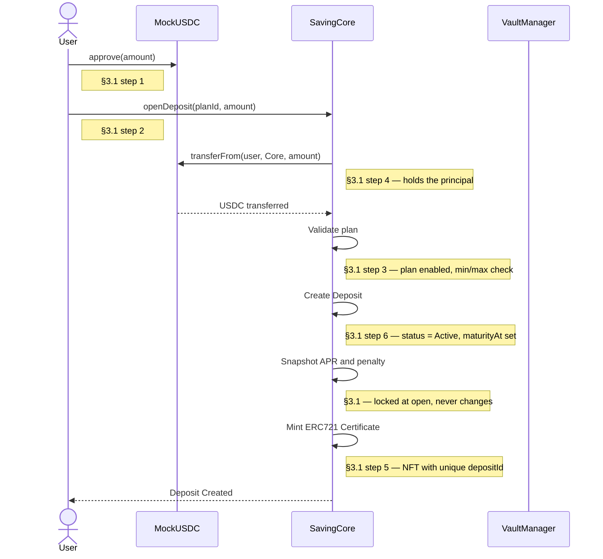
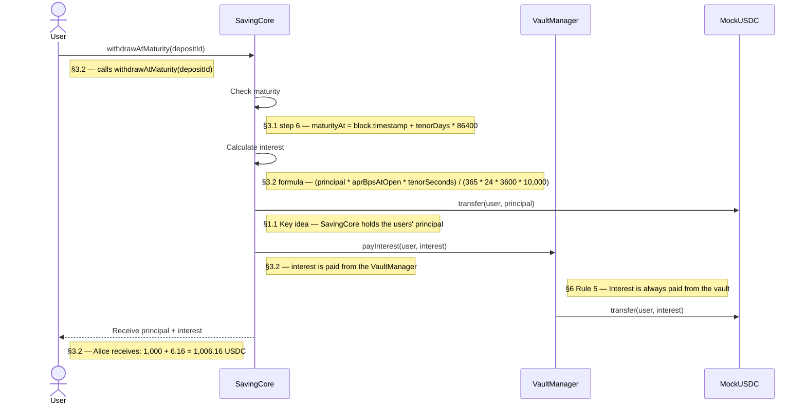
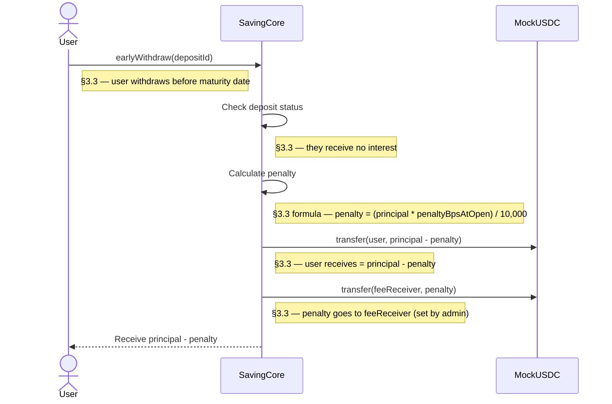
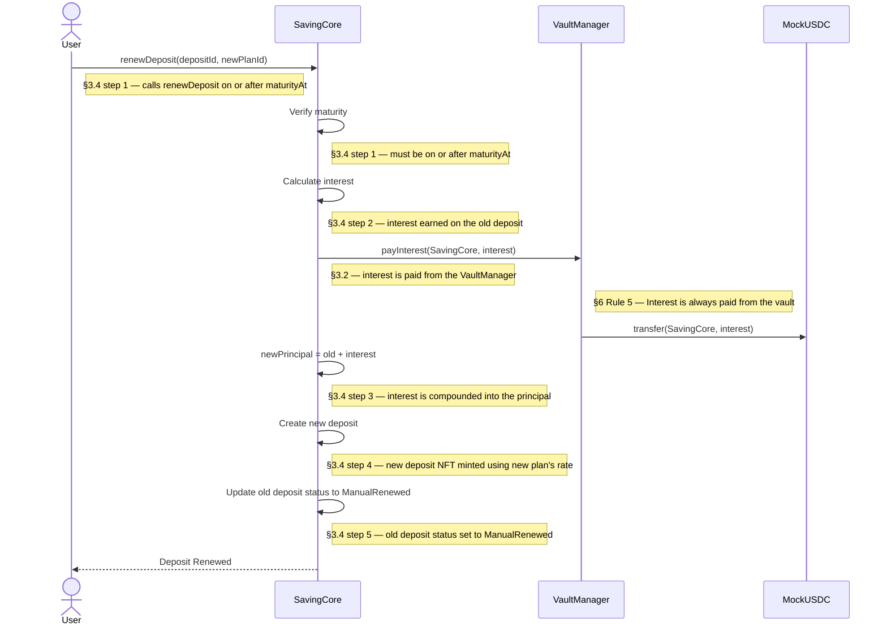
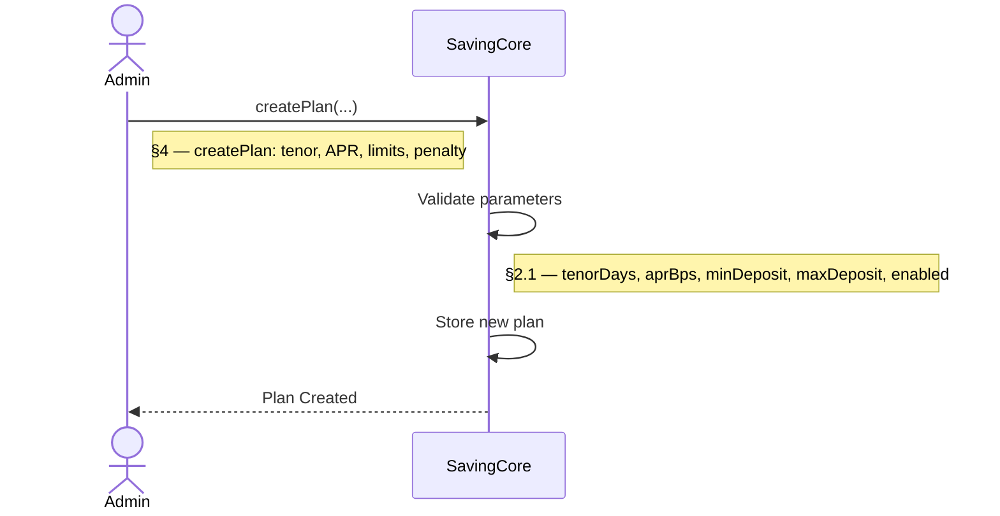
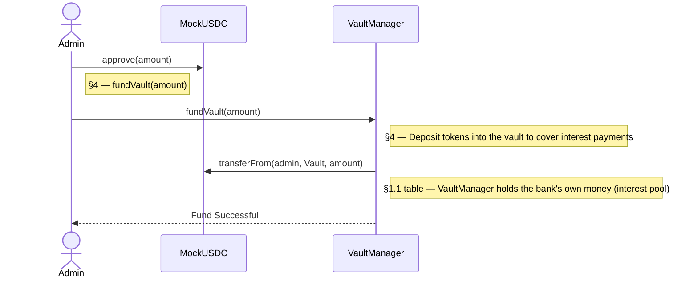

# Sequence Diagrams

This document describes the main workflows of the Online Saving System.

---

# 1. Open Deposit

---

# 2. Withdraw at Maturity

---

# 3. Early Withdrawal

---

# 4. Renew Deposit

---

# 5. Admin Creates a Saving Plan

---

# 6. Admin Funds the Vault

---

# Notes

- All deposits are stored in `SavingCore`. (§1.1 table — SavingCore: "All business logic: plans, open deposit, withdraw, renew")
- User funds (principal) are held by `SavingCore`. Bank interest pool is held by `VaultManager`. (§1.1 Key idea — "SavingCore holds the users' principal. VaultManager holds the bank's interest money.")
- `MockUSDC` is used only for local testing. (§1.1 table — MockUSDC: "A fake USDC token, 6 decimals, anyone can mint it for testing.")
- Each successful deposit mints an ERC721 certificate representing ownership. (§2.2 — "When a user opens a deposit, the contract mints an ERC721 NFT")