# Sequence Diagrams

This document describes the main workflows of the Online Saving System as sequence diagrams. Each diagram shows the message flow between actors (User, Admin, Bot), smart contracts (`SavingCore`, `VaultManager`, `MockUSDC`), and external addresses (`feeReceiver`).

---

## 1. Open Deposit — §3.1

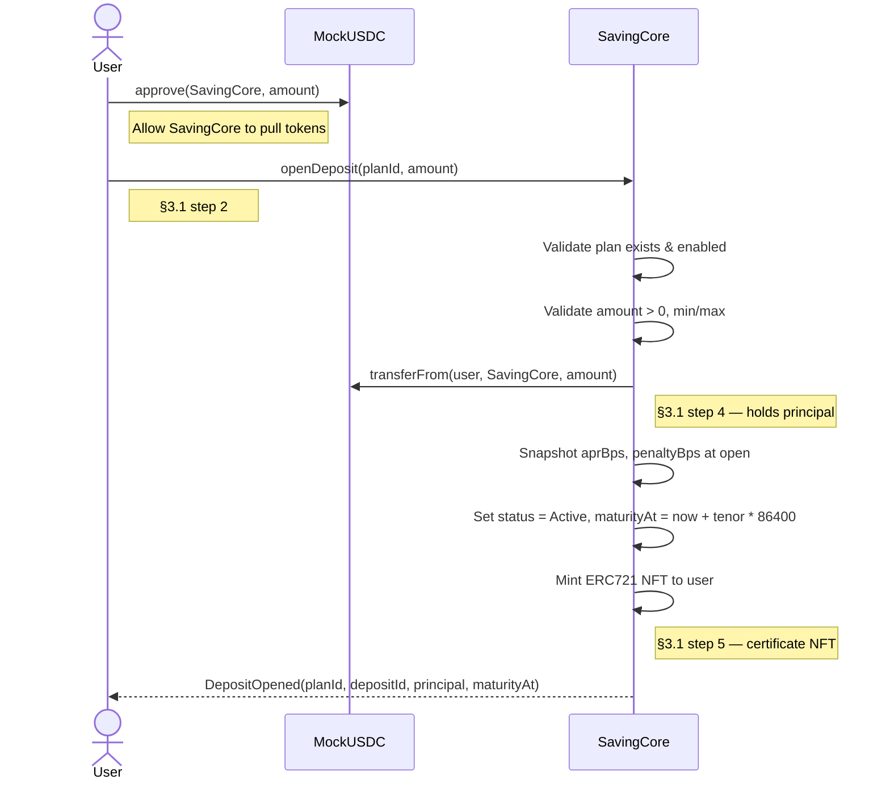
```mermaid
sequenceDiagram
    actor User
    participant USDC as MockUSDC
    participant Core as SavingCore

    User->>USDC: approve(SavingCore, amount)
    Note right of User: Allow SavingCore to pull tokens

    User->>Core: openDeposit(planId, amount)
    Note right of User: §3.1 step 2

    Core->>Core: Validate plan exists & enabled
    Core->>Core: Validate amount > 0, min/max

    Core->>USDC: transferFrom(user, SavingCore, amount)
    Note right of Core: §3.1 step 4 — holds principal

    Core->>Core: Snapshot aprBps, penaltyBps at open
    Core->>Core: Set status = Active, maturityAt = now + tenor * 86400
    Core->>Core: Mint ERC721 NFT to user
    Note right of Core: §3.1 step 5 — certificate NFT

    Core-->>User: DepositOpened(planId, depositId, principal, maturityAt)
```

---

## 2. Withdraw at Maturity — §3.2

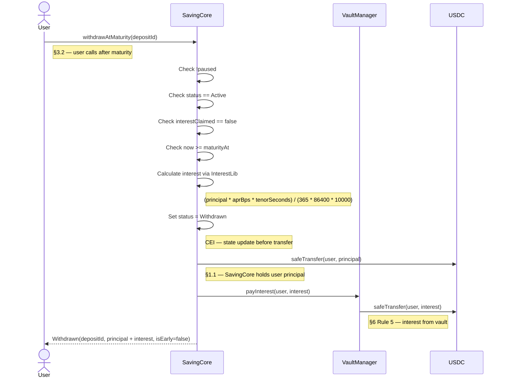
```mermaid
sequenceDiagram
    actor User
    participant Core as SavingCore
    participant Vault as VaultManager

    User->>Core: withdrawAtMaturity(depositId)
    Note right of User: §3.2 — user calls after maturity

    Core->>Core: Check !paused
    Core->>Core: Check status == Active
    Core->>Core: Check interestClaimed == false
    Core->>Core: Check now >= maturityAt

    Core->>Core: Calculate interest via InterestLib
    Note right of Core: (principal * aprBps * tenorSeconds) / (365 * 86400 * 10000)

    Core->>Core: Set status = Withdrawn
    Note right of Core: CEI — state update before transfer

    Core->>USDC: safeTransfer(user, principal)
    Note right of Core: §1.1 — SavingCore holds user principal

    Core->>Vault: payInterest(user, interest)
    Vault->>USDC: safeTransfer(user, interest)
    Note right of Vault: §6 Rule 5 — interest from vault

    Core-->>User: Withdrawn(depositId, principal + interest, isEarly=false)
```

---

## 3. Early Withdrawal — §3.3

> **Note:** `earlyWithdraw` has **NO** `whenNotPaused` — users can always exit early, even during pause.

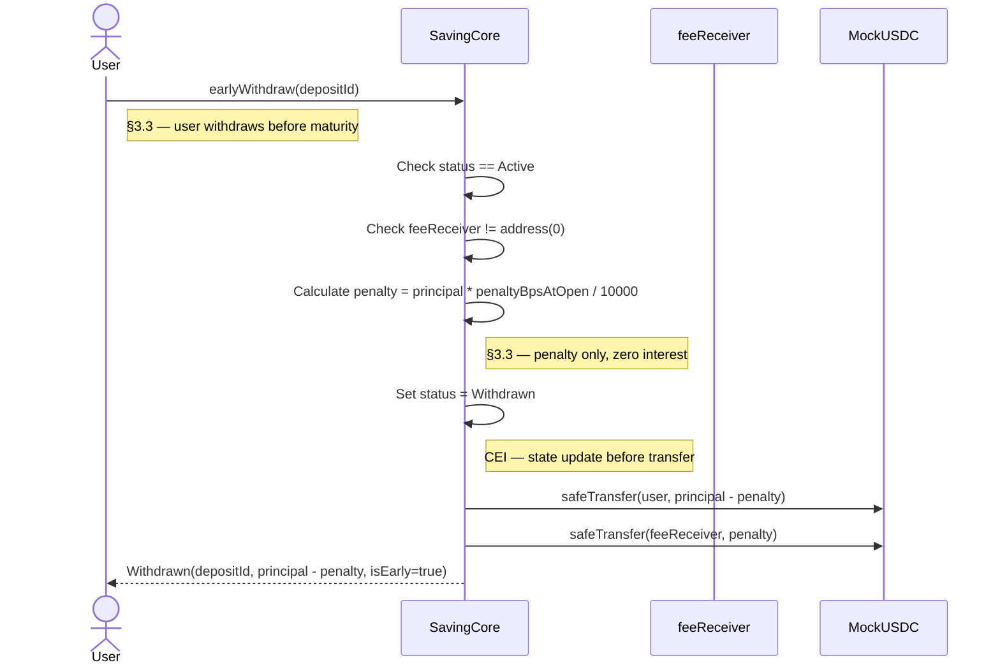
```mermaid
sequenceDiagram
    actor User
    participant Core as SavingCore
    participant feeR as feeReceiver
    participant USDC as MockUSDC

    User->>Core: earlyWithdraw(depositId)
    Note right of User: §3.3 — user withdraws before maturity

    Core->>Core: Check status == Active
    Core->>Core: Check feeReceiver != address(0)

    Core->>Core: Calculate penalty = principal * penaltyBpsAtOpen / 10000
    Note right of Core: §3.3 — penalty only, zero interest

    Core->>Core: Set status = Withdrawn
    Note right of Core: CEI — state update before transfer

    Core->>USDC: safeTransfer(user, principal - penalty)
    Core->>USDC: safeTransfer(feeReceiver, penalty)

    Core-->>User: Withdrawn(depositId, principal - penalty, isEarly=true)
```

---

## 4. Manual Renew — §3.4

> **Note:** Allows `PrincipalClaimed` status — user can renew even after claiming principal.

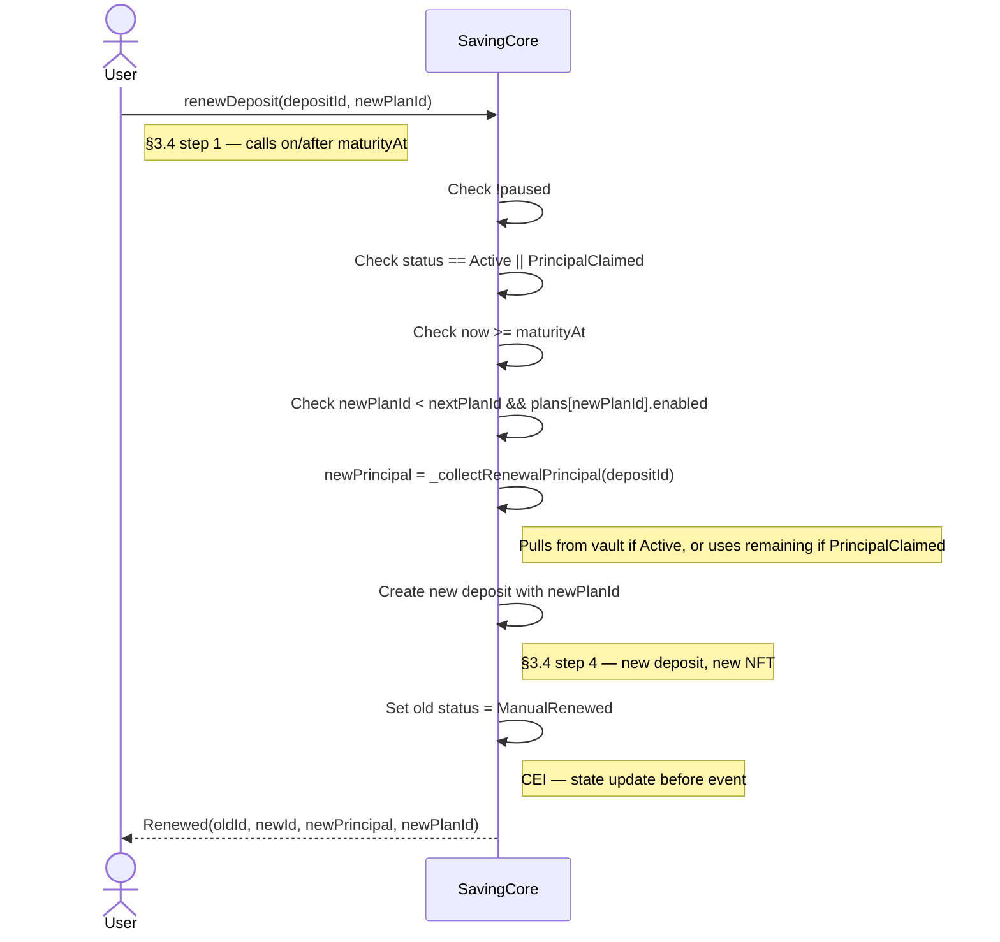
```mermaid
sequenceDiagram
    actor User
    participant Core as SavingCore

    User->>Core: renewDeposit(depositId, newPlanId)
    Note right of User: §3.4 step 1 — calls on/after maturityAt

    Core->>Core: Check !paused
    Core->>Core: Check status == Active || PrincipalClaimed
    Core->>Core: Check now >= maturityAt
    Core->>Core: Check newPlanId < nextPlanId && plans[newPlanId].enabled

    Core->>Core: newPrincipal = _collectRenewalPrincipal(depositId)
    Note right of Core: Pulls from vault if Active, or uses remaining if PrincipalClaimed

    Core->>Core: Create new deposit with newPlanId
    Note right of Core: §3.4 step 4 — new deposit, new NFT

    Core->>Core: Set old status = ManualRenewed
    Note right of Core: CEI — state update before event

    Core-->>User: Renewed(oldId, newId, newPrincipal, newPlanId)
```

---

## 5. Auto-Renew — §3.5

> **Note:** `autoRenewDeposit` has `whenNotPaused` — blocked during pause. No owner check — bot-triggerable.

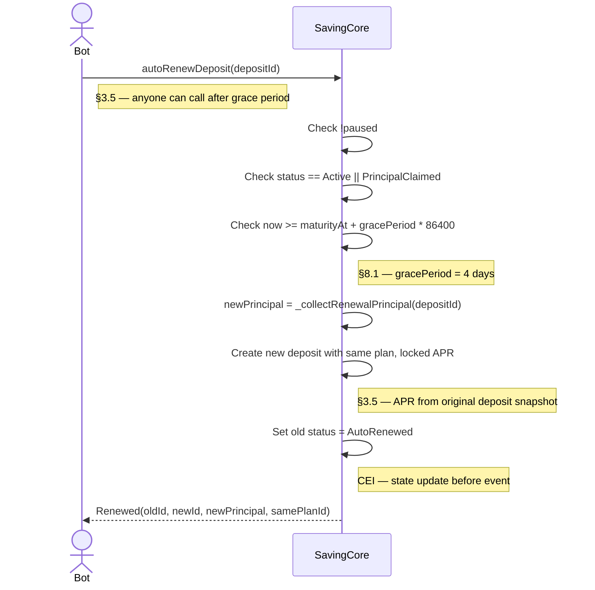
```mermaid
sequenceDiagram
    actor Bot
    participant Core as SavingCore

    Bot->>Core: autoRenewDeposit(depositId)
    Note right of Bot: §3.5 — anyone can call after grace period

    Core->>Core: Check !paused
    Core->>Core: Check status == Active || PrincipalClaimed
    Core->>Core: Check now >= maturityAt + gracePeriod * 86400
    Note right of Core: §8.1 — gracePeriod = 4 days

    Core->>Core: newPrincipal = _collectRenewalPrincipal(depositId)

    Core->>Core: Create new deposit with same plan, locked APR
    Note right of Core: §3.5 — APR from original deposit snapshot

    Core->>Core: Set old status = AutoRenewed
    Note right of Core: CEI — state update before event

    Core-->>Bot: Renewed(oldId, newId, newPrincipal, samePlanId)
```

---

## 6. Admin Creates a Saving Plan — §4

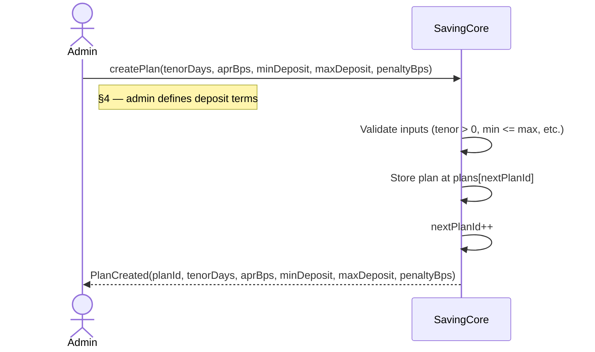
```mermaid
sequenceDiagram
    actor Admin
    participant Core as SavingCore

    Admin->>Core: createPlan(tenorDays, aprBps, minDeposit, maxDeposit, penaltyBps)
    Note right of Admin: §4 — admin defines deposit terms

    Core->>Core: Validate inputs (tenor > 0, min <= max, etc.)

    Core->>Core: Store plan at plans[nextPlanId]
    Core->>Core: nextPlanId++

    Core-->>Admin: PlanCreated(planId, tenorDays, aprBps, minDeposit, maxDeposit, penaltyBps)
```

---

## 7. Admin Funds the Vault — §4

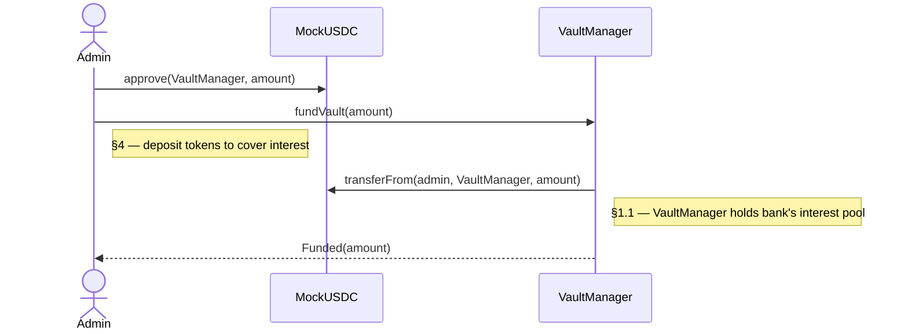
```mermaid
sequenceDiagram
    actor Admin
    participant USDC as MockUSDC
    participant Vault as VaultManager

    Admin->>USDC: approve(VaultManager, amount)

    Admin->>Vault: fundVault(amount)
    Note right of Admin: §4 — deposit tokens to cover interest

    Vault->>USDC: transferFrom(admin, VaultManager, amount)
    Note right of Vault: §1.1 — VaultManager holds bank's interest pool

    Vault-->>Admin: Funded(amount)
```

---

## 8. Claim Principal (C1 — Principal Protection) — §8.3

> **Key design:** No `whenNotPaused` — user can **always** reclaim principal, even during pause.

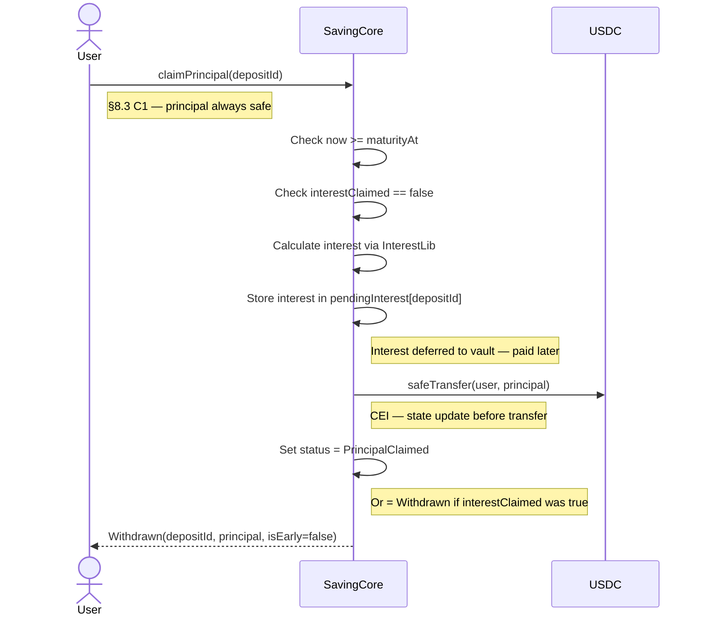
```mermaid
sequenceDiagram
    actor User
    participant Core as SavingCore

    User->>Core: claimPrincipal(depositId)
    Note right of User: §8.3 C1 — principal always safe

    Core->>Core: Check now >= maturityAt
    Core->>Core: Check interestClaimed == false

    Core->>Core: Calculate interest via InterestLib
    Core->>Core: Store interest in pendingInterest[depositId]
    Note right of Core: Interest deferred to vault — paid later

    Core->>USDC: safeTransfer(user, principal)
    Note right of Core: CEI — state update before transfer

    Core->>Core: Set status = PrincipalClaimed
    Note right of Core: Or = Withdrawn if interestClaimed was true

    Core-->>User: Withdrawn(depositId, principal, isEarly=false)
```

---

## 9. Claim Interest (C1 — Partial Vault Payment) — §8.3

> **Note:** `claimInterest` has `whenNotPaused` on SavingCore. If VaultManager is also paused, `payInterest` reverts.

### Path A: Active Status (vault pays directly)

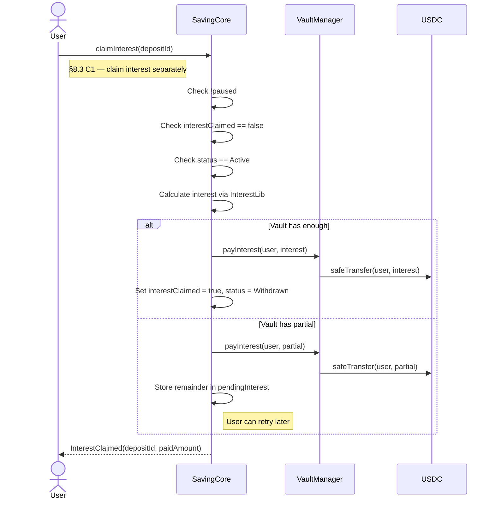
```mermaid
sequenceDiagram
    actor User
    participant Core as SavingCore
    participant Vault as VaultManager

    User->>Core: claimInterest(depositId)
    Note right of User: §8.3 C1 — claim interest separately

    Core->>Core: Check !paused
    Core->>Core: Check interestClaimed == false
    Core->>Core: Check status == Active

    Core->>Core: Calculate interest via InterestLib

    alt Vault has enough
        Core->>Vault: payInterest(user, interest)
        Vault->>USDC: safeTransfer(user, interest)
        Core->>Core: Set interestClaimed = true, status = Withdrawn
    else Vault has partial
        Core->>Vault: payInterest(user, partial)
        Vault->>USDC: safeTransfer(user, partial)
        Core->>Core: Store remainder in pendingInterest
        Note right of Core: User can retry later
    end

    Core-->>User: InterestClaimed(depositId, paidAmount)
```

### Path B: PrincipalClaimed Status (pays from pendingInterest)

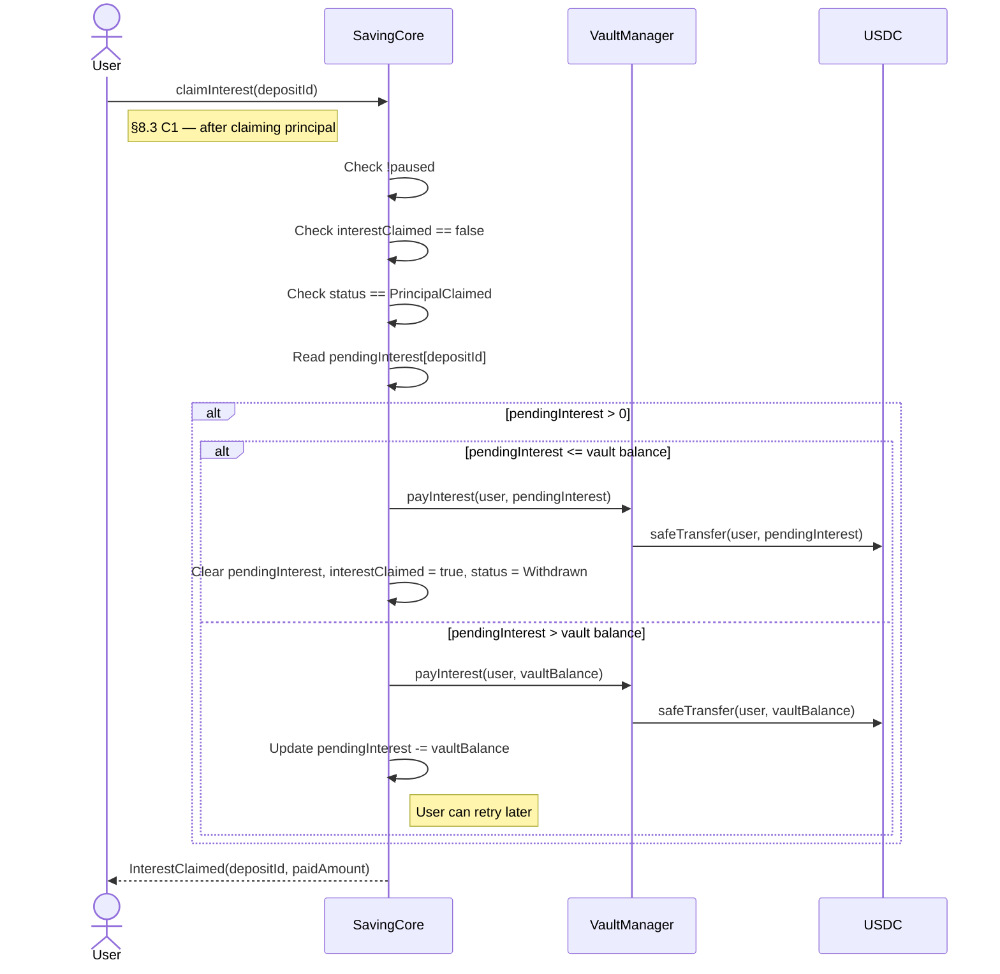
```mermaid
sequenceDiagram
    actor User
    participant Core as SavingCore
    participant Vault as VaultManager

    User->>Core: claimInterest(depositId)
    Note right of User: §8.3 C1 — after claiming principal

    Core->>Core: Check !paused
    Core->>Core: Check interestClaimed == false
    Core->>Core: Check status == PrincipalClaimed

    Core->>Core: Read pendingInterest[depositId]

    alt pendingInterest > 0
        alt pendingInterest <= vault balance
            Core->>Vault: payInterest(user, pendingInterest)
            Vault->>USDC: safeTransfer(user, pendingInterest)
            Core->>Core: Clear pendingInterest, interestClaimed = true, status = Withdrawn
        else pendingInterest > vault balance
            Core->>Vault: payInterest(user, vaultBalance)
            Vault->>USDC: safeTransfer(user, vaultBalance)
            Core->>Core: Update pendingInterest -= vaultBalance
            Note right of Core: User can retry later
        end
    end

    Core-->>User: InterestClaimed(depositId, paidAmount)
```

---

## 10. Burn NFT — §2.2, §8.3 C1

> **Note:** `burn` has no `nonReentrant` (safe — only burns token). Blocked if `pendingInterest > 0` via `_update` override.

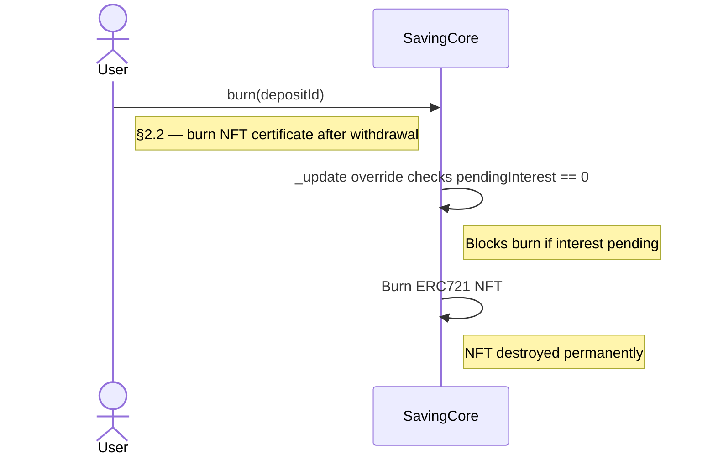
```mermaid
sequenceDiagram
    actor User
    participant Core as SavingCore

    User->>Core: burn(depositId)
    Note right of User: §2.2 — burn NFT certificate after withdrawal

    Core->>Core: _update override checks pendingInterest == 0
    Note right of Core: Blocks burn if interest pending

    Core->>Core: Burn ERC721 NFT
    Note right of Core: NFT destroyed permanently
```

---

## 11. Admin — Set SavingCore (One-Time) — §6

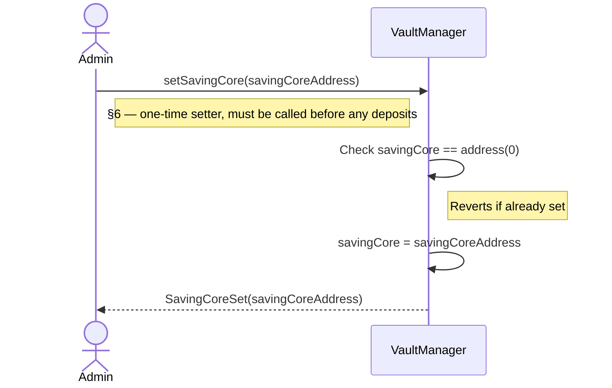
```mermaid
sequenceDiagram
    actor Admin
    participant Vault as VaultManager

    Admin->>Vault: setSavingCore(savingCoreAddress)
    Note right of Admin: §6 — one-time setter, must be called before any deposits

    Vault->>Vault: Check savingCore == address(0)
    Note right of Vault: Reverts if already set

    Vault->>Vault: savingCore = savingCoreAddress

    Vault-->>Admin: SavingCoreSet(savingCoreAddress)
```

---

## 12. Admin — Pause / Unpause (Dual-Pause Architecture)

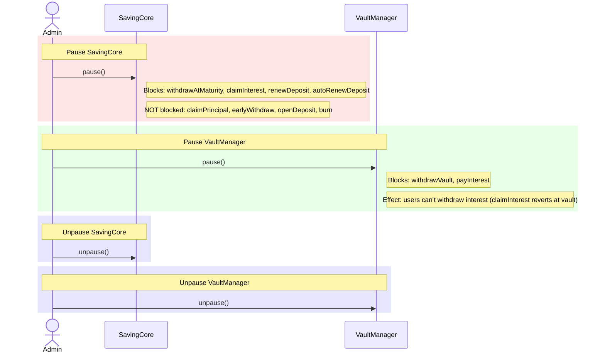
```mermaid
sequenceDiagram
    actor Admin
    participant Core as SavingCore
    participant Vault as VaultManager

    rect rgb(255, 230, 230)
        Note over Admin,Core: Pause SavingCore
        Admin->>Core: pause()
        Note right of Core: Blocks: withdrawAtMaturity, claimInterest, renewDeposit, autoRenewDeposit
        Note right of Core: NOT blocked: claimPrincipal, earlyWithdraw, openDeposit, burn
    end

    rect rgb(230, 255, 230)
        Note over Admin,Vault: Pause VaultManager
        Admin->>Vault: pause()
        Note right of Vault: Blocks: withdrawVault, payInterest
        Note right of Vault: Effect: users can't withdraw interest (claimInterest reverts at vault)
    end

    rect rgb(230, 230, 255)
        Note over Admin,Core: Unpause SavingCore
        Admin->>Core: unpause()
    end

    rect rgb(230, 230, 255)
        Note over Admin,Vault: Unpause VaultManager
        Admin->>Vault: unpause()
    end
```

---

## 13. Admin — Withdraw Vault Funds — §4

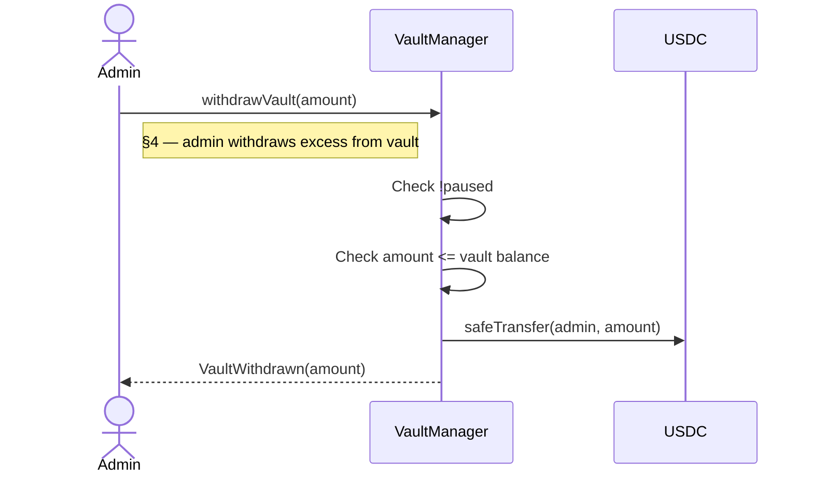
```mermaid
sequenceDiagram
    actor Admin
    participant Vault as VaultManager

    Admin->>Vault: withdrawVault(amount)
    Note right of Admin: §4 — admin withdraws excess from vault

    Vault->>Vault: Check !paused
    Vault->>Vault: Check amount <= vault balance

    Vault->>USDC: safeTransfer(admin, amount)

    Vault-->>Admin: VaultWithdrawn(amount)
```

---

## Architecture Overview

```
┌──────────────┐         ┌──────────────┐         ┌──────────────┐
│              │         │              │         │              │
│  MockUSDC    │◄────────│  SavingCore  │────────►│ VaultManager │
│  (6 decimals)│         │  (principal) │         │  (interest)  │
│              │         │              │         │              │
└──────────────┘         └──────────────┘         └──────────────┘
                              ▲   ▲                      ▲
                              │   │                      │
                        ┌─────┘   └─────┐         ┌──────┘
                        │               │         │
                     User            Bot      feeReceiver
                  (depositor)   (auto-renew)    (penalties)
```

## Notes

- **Fund separation**: SavingCore holds user principal. VaultManager holds bank's interest pool. This is the core architectural rule (§1.1).
- **CEI order**: State updates happen before external transfers in every flow. This prevents re-entrancy and double-claim bugs.
- **Pause architecture**: SavingCore and VaultManager have independent pause switches. `claimPrincipal` is deliberately NOT blocked by either pause — principal is always safe (§8.3 C1).
- **Partial vault payment**: If vault has insufficient funds during `claimInterest`, user receives partial payment and can retry later. `interestClaimed` stays false until full amount is received.
- **NFT lifecycle**: Minted at deposit open. Burned after full withdrawal (principal claimed AND interest claimed or no pending interest). `burn` is blocked while `pendingInterest > 0`.
