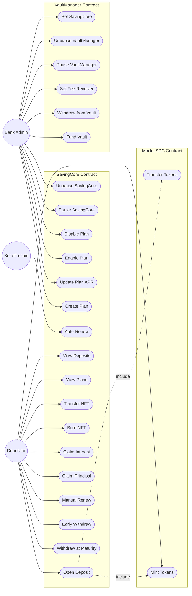
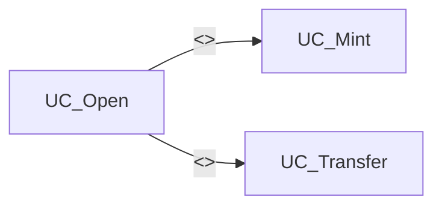

# Use Case Diagram

## System Overview

This document describes the use case diagram for the **Blockchain-Based Online Saving System**. The system consists of three smart contracts: **SavingCore** (business logic + ERC721 certificates), **VaultManager** (liquidity pool + admin controls), and **MockUSDC** (test ERC20 token).

---

## Actors

| Actor | Type | Description | Source |
|-------|------|-------------|--------|
| **Depositor** | Primary | User who opens deposits, withdraws funds, claims principal/interest, burns NFTs, and renews terms | §1, §8.3 |
| **Bank Admin** | Primary | Manages saving plans, vault funding, fee receiver, system pause state, and vault-core link | §1, §4, §6 |
| **Bot (off-chain)** | Secondary | External service that triggers auto-renew after the grace period expires | §3.5 |

---

## System Boundary Diagram

---

## Use Case Descriptions — SavingCore

| # | Use Case | Actor | Description | Source |
|---|----------|-------|-------------|--------|
| 1 | **Open Deposit** | Depositor | Select a plan, approve MockUSDC, deposit principal; mints an ERC721 NFT certificate; APR and penalty are snapshotted at open time | §3.1 |
| 2 | **Withdraw at Maturity** | Depositor | Withdraw principal + interest after `maturityAt`; interest paid from VaultManager; reverts if `PrincipalClaimed` or `interestClaimed` | §3.2 |
| 3 | **Early Withdraw** | Depositor | Withdraw before maturity with penalty deducted; zero interest paid; penalty sent to feeReceiver; NO `whenNotPaused` — always available | §3.3 |
| 4 | **Manual Renew** | Depositor | At or after maturity, compound interest into new principal and open a new deposit on a selected plan; allows `PrincipalClaimed` status | §3.4 |
| 5 | **Auto-Renew** | Bot | After grace period (default: 4 days), bot triggers auto-renew; original APR is locked, same tenor; has `whenNotPaused` | §3.5 |
| 6 | **Claim Principal** | Depositor | C1: Claim principal at maturity without vault dependency; interest deferred to `pendingInterest`; NO `whenNotPaused` — always available | §8.3 C1 |
| 7 | **Claim Interest** | Depositor | C1: Claim interest with partial vault payment; supports Active (vault pays directly) and PrincipalClaimed (from `pendingInterest`) paths | §8.3 C1 |
| 8 | **Burn NFT** | Depositor | Burn ERC721 certificate after full withdrawal; blocked if `pendingInterest > 0` via `_update` override | §2.2, §8.3 C1 |
| 9 | **Transfer NFT** | Depositor | Transfer the ERC721 deposit certificate to another address; new owner becomes deposit owner | §2.2, §8.2 |
| 10 | **Create Plan** | Bank Admin | Create a new saving plan with tenor, APR, min/max deposit, and penalty | §4 |
| 11 | **Update Plan APR** | Bank Admin | Change APR for a plan; only affects future deposits, never existing ones | §4 |
| 12 | **Enable Plan** | Bank Admin | Allow users to open deposits for this plan | §4 |
| 13 | **Disable Plan** | Bank Admin | Stop new deposits for this plan; existing deposits remain active | §4 |
| 14 | **Pause SavingCore** | Bank Admin | Emergency stop; blocks `withdrawAtMaturity`, `claimInterest`, `renewDeposit`, `autoRenewDeposit`; does NOT block `claimPrincipal`, `earlyWithdraw`, `openDeposit`, `burn` | §4 |
| 15 | **Unpause SavingCore** | Bank Admin | Resume normal operations after pause | §4 |
| 16 | **View Plans** | Depositor | Read list of enabled/disabled plans with their parameters | §7.3 |
| 17 | **View Deposits** | Depositor | Read status and details of owned deposit NFTs | §7.3 |

---

## Use Case Descriptions — VaultManager

| # | Use Case | Actor | Description | Source |
|---|----------|-------|-------------|--------|
| 18 | **Fund Vault** | Bank Admin | Deposit MockUSDC into the vault to cover interest payments | §4 |
| 19 | **Withdraw from Vault** | Bank Admin | Remove tokens from the vault; has `whenNotPaused` — blocked during vault pause | §4 |
| 20 | **Set Fee Receiver** | Bank Admin | Set the address that receives early-withdrawal penalties; one-time or overwritable | §4 |
| 21 | **Pause VaultManager** | Bank Admin | Emergency stop; blocks `withdrawVault` and `payInterest`; complete vault freeze during pause | §4 |
| 22 | **Unpause VaultManager** | Bank Admin | Resume vault operations after pause | §4 |
| 23 | **Set SavingCore** | Bank Admin | One-time setter; links VaultManager to SavingCore; must be called before any deposits; reverts if already set | §6 |

---

## Use Case Descriptions — MockUSDC

| # | Use Case | Actor | Description | Source |
|---|----------|-------|-------------|--------|
| 24 | **Mint Tokens** | Depositor | Mint test MockUSDC tokens for testing | §1.1 |
| 25 | **Transfer Tokens** | Depositor | Transfer MockUSDC to another address | (inferred) |

---

## Include / Extend Relationships

| Relationship | Type | Explanation | Source |
|--------------|------|-------------|--------|
| Open Deposit → Mint Tokens | `<<include>>` | Every deposit requires a MockUSDC token transfer first | §1.1 |
| Open Deposit → Transfer Tokens | `<<include>>` | SavingCore calls `transferFrom` to pull tokens from user | §3.1 step 4 |

---

## Pause Architecture — Dual-Pause Map

| Pause Target | Blocks | Does NOT Block | Source |
|-------------|--------|----------------|--------|
| **SavingCore.paused** | `withdrawAtMaturity`, `claimInterest`, `renewDeposit`, `autoRenewDeposit` | `claimPrincipal`, `earlyWithdraw`, `openDeposit`, `burn` | §4, §8.3 C1 |
| **VaultManager.paused** | `withdrawVault`, `payInterest` (→ `claimInterest` reverts at vault level) | `fundVault`, `setFeeReceiver`, `setSavingCore` | §4 |
| **Both paused** | All user withdrawals/renewals; vault completely frozen | `claimPrincipal` (uses SavingCore balance), `earlyWithdraw` (uses SavingCore balance), `openDeposit` | §8.3 C1 |

---

## Bonus Challenges — §8.3

| Bonus | Use Case | Status | Description | Source |
|-------|----------|--------|-------------|--------|
| **C1** | Claim Principal + Claim Interest | **Implemented** | `claimPrincipal`: principal always safe, no vault dependency, interest stored as `pendingInterest`. `claimInterest`: partial vault payment with retry support. Both as separate functions, not a branch | §8.3 C1 |
| **C2** | Solvency Guard | Not Implemented | — | §8.3 C2 |
| **C3** | Partial Early Withdraw | Not Implemented | — | §8.3 C3 |
| **C4** | Top-up Deposit | Not Implemented | — | §8.3 C4 |
| **C5** | Custom Idea | Not Implemented | — | §8.3 C5 |

---

## Mapping: Use Cases to Business Rules (BR)

| Use Case | Business Rules |
|----------|----------------|
| Open Deposit | BR-01 (min deposit), BR-02 (max deposit), BR-04 (APR snapshot), BR-05 (NFT mint) |
| Withdraw at Maturity | BR-06 (simple interest formula), BR-07 (single withdraw), BR-10 (vault pays interest) |
| Early Withdraw | BR-03 (zero interest + penalty), BR-15 (fee receiver), BR-18 (principal always safe) |
| Manual Renew | BR-08 (compound principal + interest), BR-13 (new deposit created), BR-14 (new NFT minted) |
| Auto-Renew | BR-09 (grace period), BR-11 (APR lock), BR-12 (same tenor), BR-13 (new deposit created) |
| Claim Principal | BR-18 (principal always safe, no vault dependency), BR-19 (interest deferred to pendingInterest) |
| Claim Interest | BR-19 (partial vault payment with retry), BR-20 (pendingInterest tracking), BR-21 (full/ partial settlement) |
| Burn NFT | BR-21 (blocked if pendingInterest > 0) |
| Pause SavingCore | BR-16 (blocks withdrawAtMaturity, claimInterest, renewDeposit, autoRenewDeposit) |
| Pause VaultManager | BR-16 (blocks withdrawVault and payInterest) |
| Fund Vault | BR-10 (vault must have funds for interest payments) |
| Withdraw from Vault | BR-17 (vault balance safety) |
| Set SavingCore | BR-17 (one-time setter, must be set before deposits) |
