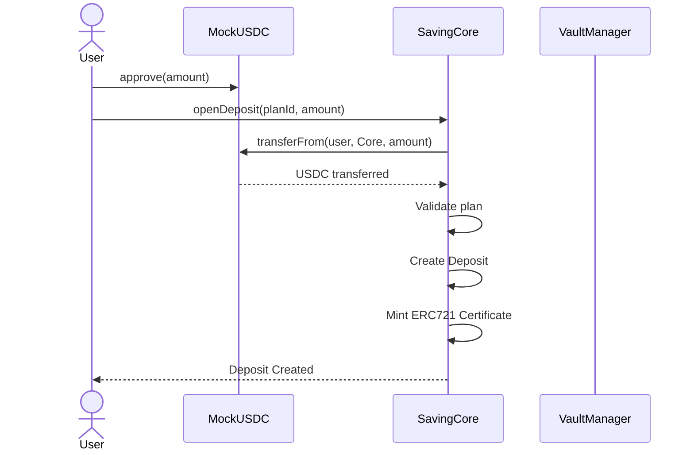
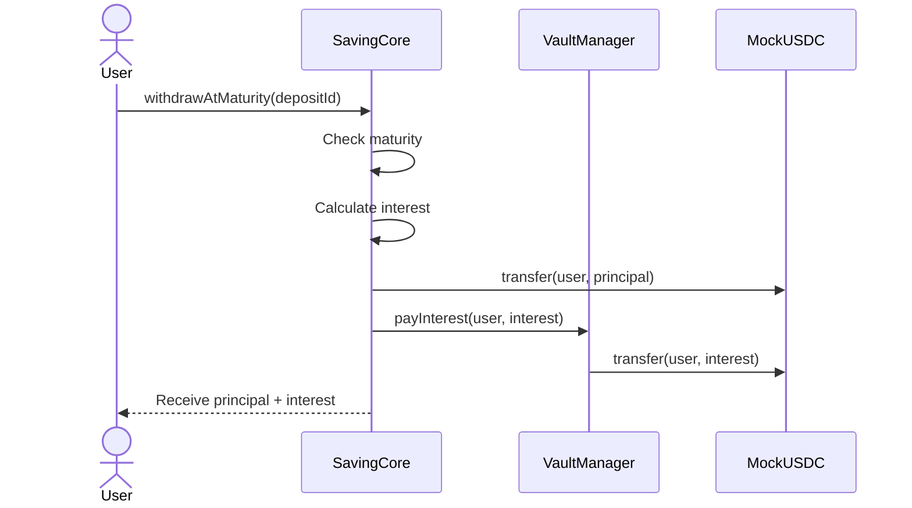
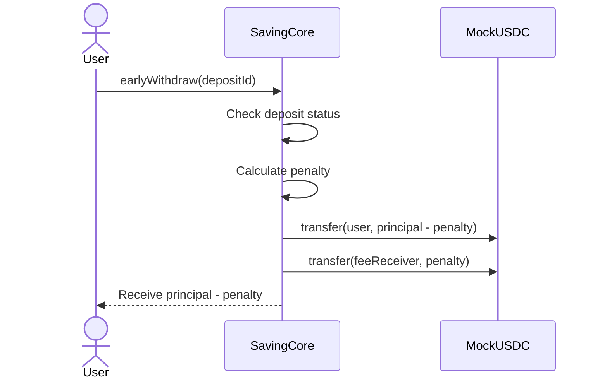
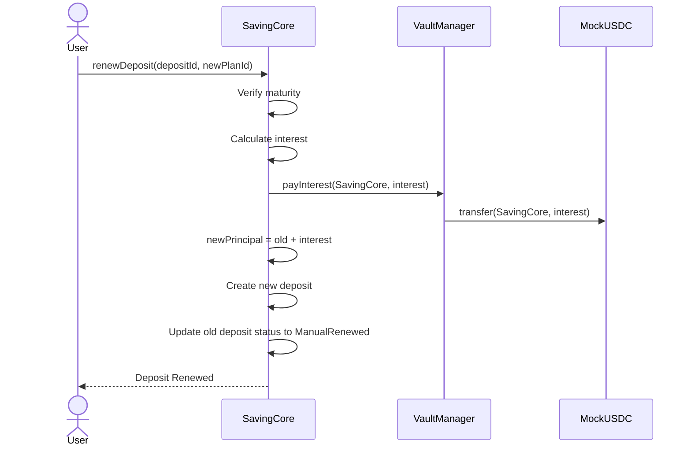
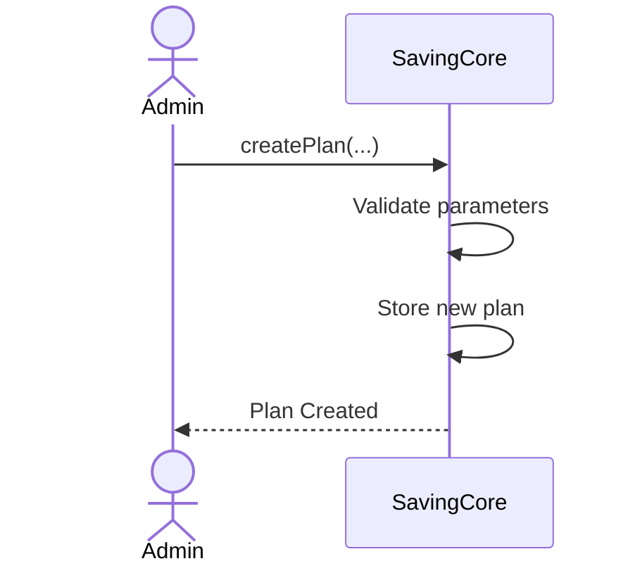
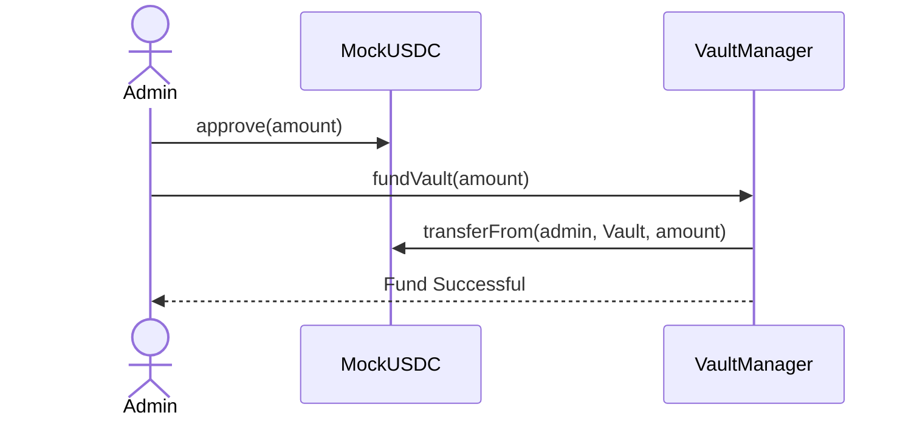

# Sequence Diagrams

This document describes the main workflows of the Online Saving System.

---

# 1. Open Deposit

---

# 2. Withdraw at Maturity

---

# 3. Early Withdrawal

---

# 4. Renew Deposit

---

# 5. Admin Creates a Saving Plan

---

# 6. Admin Funds the Vault

---

# Notes

- All deposits are stored in `SavingCore`.
- User funds (principal) are held by `SavingCore`. Bank interest pool is held by `VaultManager`.
- `MockUSDC` is used only for local testing.
- Each successful deposit mints an ERC721 certificate representing ownership.