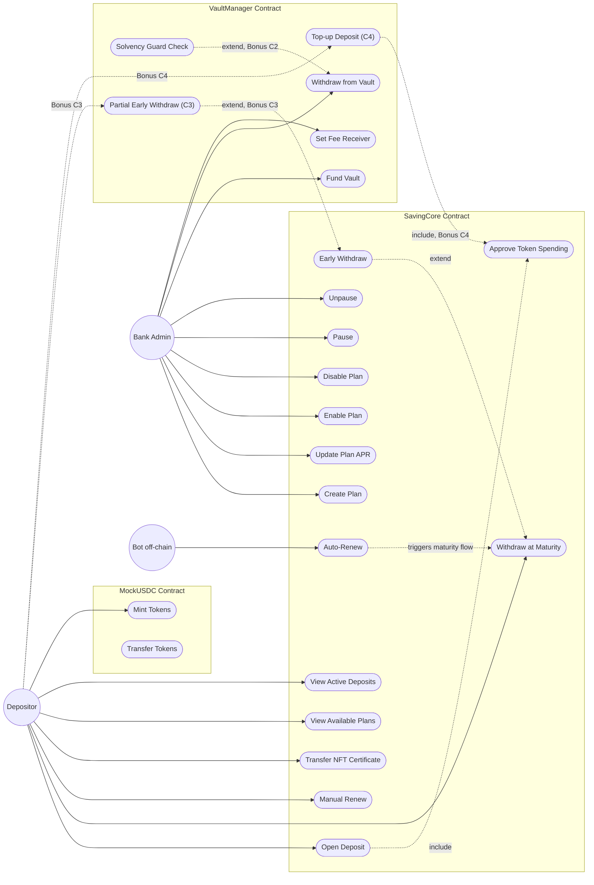
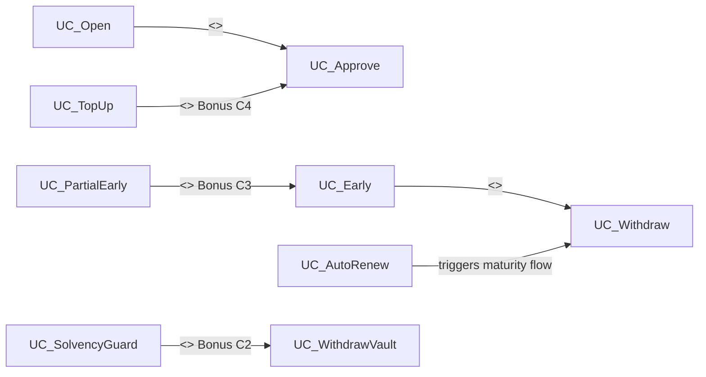

# Use Case Diagram

## System Overview

This document describes the use case diagram for the **Blockchain-Based Online Saving System**. The system consists of three smart contracts: **SavingCore** (business logic + ERC721 certificates), **VaultManager** (liquidity pool + admin controls), and **MockUSDC** (test ERC20 token).

---

## Actors

| Actor | Type | Description |
|-------|------|-------------|
| **Depositor** | Primary | User who opens deposits, withdraws funds, and renews terms |
| **Bank Admin** | Primary | Manages saving plans, vault funding, fee receiver, and system pause state |
| **Bot (off-chain)** | Secondary | External service that triggers auto-renew after the grace period expires |

---

## Use Case Diagram

---

## Use Case Descriptions

### Core Use Cases (SavingCore)

| # | Use Case | Actor | Description |
|---|----------|-------|-------------|
| 1 | **Approve Token Spending** | Depositor | User approves the SavingCore contract to spend MockUSDC tokens |
| 2 | **Open Deposit** | Depositor | Select a plan, deposit principal; mints an ERC721 NFT certificate; APR and penalty are snapshotted |
| 3 | **Withdraw at Maturity** | Depositor | Withdraw principal + interest after `maturityAt`; interest paid from VaultManager |
| 4 | **Early Withdraw** | Depositor | Withdraw before maturity with penalty deducted; zero interest paid; penalty sent to feeReceiver |
| 5 | **Manual Renew** | Depositor | At or after maturity, compound interest into new principal and open a new deposit on a selected plan |
| 6 | **Auto-Renew** | Bot | After grace period (default: 4 days), bot triggers auto-renew; original APR is locked, same tenor |
| 7 | **Create Plan** | Bank Admin | Create a new saving plan with tenor, APR, min/max deposit, and penalty |
| 8 | **Update Plan APR** | Bank Admin | Change APR for a plan; only affects future deposits, never existing ones |
| 9 | **Enable Plan** | Bank Admin | Allow users to open deposits for this plan |
| 10 | **Disable Plan** | Bank Admin | Stop new deposits for this plan; existing deposits remain active |
| 11 | **Pause** | Bank Admin | Emergency stop; blocks all withdrawals and renewals |
| 12 | **Unpause** | Bank Admin | Resume normal operations after pause |
| 13 | **Transfer NFT Certificate** | Depositor | Transfer the ERC721 deposit certificate to another address |
| 14 | **View Available Plans** | Depositor | Read list of enabled/disabled plans with their parameters |
| 15 | **View Active Deposits** | Depositor | Read status and details of owned deposit NFTs |

### Vault Use Cases (VaultManager)

| # | Use Case | Actor | Description |
|---|----------|-------|-------------|
| 16 | **Fund Vault** | Bank Admin | Deposit MockUSDC into the vault to cover interest payments |
| 17 | **Withdraw from Vault** | Bank Admin | Remove tokens from the vault (within safe limits) |
| 18 | **Set Fee Receiver** | Bank Admin | Set the address that receives early-withdrawal penalties |

### MockUSDC Use Cases

| # | Use Case | Actor | Description |
|---|----------|-------|-------------|
| 19 | **Mint Tokens** | Depositor | Mint test MockUSDC tokens for testing |
| 20 | **Transfer Tokens** | Depositor | Transfer MockUSDC to another address |

---

## Bonus Challenges (Section 8.3)

| Bonus | Use Case | Actor | Description |
|-------|----------|-------|-------------|
| **C1** | Principal Protection | — | Pay principal immediately at maturity even if vault is empty; record interest as pending debt |
| **C2** | Sololvency Guard Check | Bank Admin | Block `Withdraw from Vault` if it would break interest obligations to active deposits |
| **C3** | Partial Early Withdraw | Depositor | Withdraw a portion of principal early; penalty applies only to withdrawn amount |
| **C4** | Top-up Deposit | Depositor | Add more principal to an active deposit; interest calculated fairly for the new amount |
| **C5** | Custom Idea | — | Identify a gap in the spec and propose a fix |

---

## Include / Extend Relationships

| Relationship | Type | Explanation |
|--------------|------|-------------|
| Open Deposit → Approve Token Spending | `<<include>>` | Every deposit requires token approval first |
| Early Withdraw → Withdraw at Maturity | `<<extend>>` | Early withdrawal is an optional variant of the withdrawal flow |
| Partial Early Withdraw → Early Withdraw | `<<extend>>` (C3) | Bonus: partial withdrawal extends the early-withdraw concept |
| Auto-Renew → Withdraw at Maturity | triggers | Bot-initiated maturity payout feeds into the renewal flow |
| Solvency Guard → Withdraw from Vault | `<<extend>>` (C2) | Bonus: admin vault withdrawal is checked against owed interest |
| Top-up Deposit → Approve Token Spending | `<<include>>` (C4) | Bonus: adding principal requires token approval |

---

## Mapping: Use Cases to Business Rules (BR)

| Use Case | Business Rules |
|----------|----------------|
| Open Deposit | BR-01 (plan enabled), BR-04 (APR snapshot) |
| Withdraw at Maturity | BR-05 (simple interest formula), BR-10 (vault pays interest) |
| Early Withdraw | BR-03 (zero interest, penalty to feeReceiver) |
| Manual Renew | BR-06 (compound principal + interest), BR-04 (new APR snapshot) |
| Auto-Renew | BR-07 (grace period), BR-08 (original APR lock), BR-09 (same tenor) |
| Pause | BR-11 (blocks all withdrawals and renewals) |
| Fund Vault | BR-10 (vault must have funds for interest) |
| Solvency Guard (C2) | BR-16 (vault must cover future interest obligations) |
| Partial Early Withdraw (C3) | BR-17 (penalty applies only to withdrawn portion) |
